# C++ primer

## 1 开始

### 1.1

命令行中通过 	echo%ERRORLEVEL% 获得程序返回值（win）

### 1.2

cin，cout，cerr**标准错误**，输出警告和错误笑嘻，clog输出一般信息

endl **操纵符** 写入endl效果是结束当行，并且将缓冲写入设备，**缓冲刷新**

刷新缓冲可以保证崩溃的时候错误语句也能打印出来

### 1.3

/**/中可以包含一切内容，但不能嵌套，为了风格统一每行开头打个\*

### 1.4

用while可以从cin中重复读取，读到eof就停止读取，每次换行就表示一次输入，==ctrl+z输入eof==

### 1.5

标准库头文件一般没有后缀

自定义头文件一般以.h结尾，也能是.hpp .hxx

==文件重定向==


## 2 变量和基本类型

char float int 这样的是内置类型

string vector都是标准库实现的类型

### 2.1

基本数据类型中，void属于空类型，其余是算数类型

#### 2.1.1 算数类型

+ 整型：char bool
+ 浮点型：float double

c++11 才有long long

long double类型

1. char可能等于singned char或者unsigned char之一
2. 不能在计算中用char，因为在不同环境中有没有符号不能确定，如果一定要用就要指定符号，用signed char或者unsigned char
3. long一般和int尺寸相同，所以超出int用long long
4. double比float精度更高并且计算代价二者差不多，甚至有时double更快。long double精度有时候用不上，并且效率低

#### 2.1.2 类型转换

1. 给带符号类型赋值一个超出范围的值，结果是未定义，程序可能继续工作、崩溃、生成垃圾数据
2. int + unsigned ，int会强制类型转换成unsigned，int如果是负数不会报错但是会生成巨大的数字
3. unsigned 运算结果非负，但是会下溢出‘
4. 不要混用带符号和无符号，因为混用时带符号负数自动类型转换成无符号就会下溢出

#### 2.1.3 字面值常量

##### 数字型

0开头  8进制 （09错的，八进制最多只有7）

0x、0X开头  16进制

十进制字面值默认带符号，八进制十六进制不一定

十进制字面值类型是符合要求的最短类型，从带符号类型中取

八进制和十六进制从带符号和不带符号类型中取

字面值中的负号不属于字面值，表示对字面值取负

浮点型表示为一个小数或者用科学记数法表示的指数

科学记数法指数用 e、E表示


##### 字符型

'a' 字符字面值 		"a" 字符串字面值

编译器会给字符串字面值后面添加一个空字符'\0'，所以实际长度会加一 	"a" -> "a\0"

字符串字面值换行不用+号


==泛化的转义序列==

\x后面紧跟1或多个16进制数字，或者\后面紧跟1,2,3个八进制数字，数字部分表示的是字符对应的数值


\后面最多解释三个八进制数字，\x后面解释所有数字


##### bool和指针字面值

true、false、nullptr

### 2.2 变量

对象（object）指的是一块能存储数据并且具有某种类型的内存空间，本书不区分是类还是内置类型，是否命名或是否只读

在c++中**赋值和初始化是不同的操作**（虽然都是=），但是区别无关紧要

初始化是创建变量赋予初始值，赋值是删除对象当前的值，用一个新值替代
#### 2.2.1 变量定义

##### 列表初始化

c++11 用花括号初始化变量或者为对象赋新值

```c++
int a{3};
int a={3};
std::vector<int> v{1, 3, 5};
//圆括号初始化
//不能用于给类内成员赋初始值
int a(3);
//等号不能用于拷贝对象
std::atomic<int> ai1{ 0 };  // 可以
std::atomic<int> ai2( 0 );  // 可以
std::atomic<int> ai3 = 0;   // 报错
//使用小括号无参构造可能会被识别成声明函数，有歧义
List a();
//列表初始化有缺点
//如果构造函数的形参带有std::initializer_list，调用构造函数时大括号初始化语法会强制使用带std::initializer_list参数的重载构造函数
//也就是所有能转换成std::initializer_list这种类型的值都会走这个构造函数，即使类型能够精准匹配别的构造函数
Widget w2{};   // 调用默认构造函数
Widget w4({});   // 用了一个空的list来调用带std::initializer_list构造函数
//https://zhuanlan.zhihu.com/p/268894227
```

给内置类型使用列表初始化会识别出丢失信息的风险


##### 默认初始化

有的类如果不初始化就定义对象会报错

定义于函数体内的内置类型的对象如果没有初始化那么值就未定义，类对象没有显式初始化，值就由类（的设计者）确定

#### 2.2.2 变量声明和定义的关系

**分离式编译** 允许把程序拆分成多个逻辑部分来写，分割后的文件可以被独立编译，所以把声明和定义分开

```c++
extern int i; //声明不定义
int j; //声明且定义
extern int i = 0; //声明且定义，违背了extern的效果，会报错
```

变量可以被==多次声明==，但只能==一次定义==

在多个文件中使用同一个变量就要采取分离声明和定义，此时定义只能出现在一个文件中，其他文件声明它。

#### 2.2.3 标识符

identifier，也就是变量名

#### 2.2.4名字作用域

### 2.3 复合类型

指基于其他类型定义的类型

声明语句 = 基本数据类型+声明符列表

每个声明符命名了一个变量并指定该变量为基本数据类型有关的某种类型

#### 2.3.1 引用

c++11右值引用，常用的是左值引用

引用必须初始化，不可以换绑，相当于一个别名

引用本身不是对象，所以不能定义引用的引用


引用只能绑定给对象

#### 2.3.2 指针


生成空指针的三个方法


NULL==预处理变量== 值就是0

最好使用nullptr

##### void*指针

可以存放任意对象的地址

#### 2.3.3 理解复合类型的声明

要写成int \*p而不是int\* p，*&只是对于变量名的修饰

int* p强调了p是一个复合类型。

指针是一个复合对象，所以可以定义指针的指针

int **p；

引用不是对象，所以不能定义引用的指针

### 2.4 const

创建后就不能改变，所以必须初始化


如果想在多个文件之间共享const对象，就在定义之前添加extern

是不是普通变量在别的文件内也能访问到？

> 非`const`修饰的变量也可以通过该方式进行共享，例如在头文件`state.h`中添加`extern int state;`那么在所有使用`state.h`的源文件中都可以使用共享的`int state;`

#### 2.4.1 const 引用

常量引用就是对const的引用

```c++
/*错误*/
int &ri = 3.14;//不能为普通引用绑定字面值

//直接这么写是可以的
double dval = 3.14;
const int &ri = temp;
//转换成下面
double dval = 3.14;
const int temp = dval;//这一行由编译器加上，先生成一个临时的const int，同时做了类型转换，再交给下一行绑定，这个对象叫做临时量
const int &ri = temp;//引用是常量那么就无法通过引用改变原来的对象
```

常量引用仅仅限制了这个引用的功能，不能通过这个引用改变原对象

#### const和指针


指向常量的指针同样限定了这个指针的功能，同上

但是指向常量的指针也是指针，是对象，可以换绑

==常量指针==指的是这个指针本身是常量，不能换绑，但是不限定对指向对象的操作


```c++
const int *ap = &a; //指向常量的指针，限定操作
int *const ap = &a; //常量指针，不能换绑
const int *const ap = &a; //都限定了
//主要看const在哪
```

#### 2.4.3 顶层const 与 底层const

顶层const表示**指针本身**是常量（也指任意对象是常量）

底层const表示指针**指向的对象**是常量（和指针引用等复合类型的基本类型部分有关）

指针既可以是顶层const又可以是底层const

指针和引用最前面加const都是底层，限定操作，指针变量名前面，*后面的const是顶层const

#### 2.4.4 constexpr和常量表达式

常量表达式（const expression）指的是值不会改变并且在编译过程就能得到计算结果的表达式，比如字面量

c++11 constexpr，允许把变量声明为constexpr类型让编译器验证变量值是否是常量表达式。声明为constexpr的变量一定是一个常量，并且必须用常量表达式初始化。


同时也允许constexpr函数，编译时就能计算它的结果。

和普通const函数的区别？

> 从语义上来看，`const`是指“只读”，`constexpr`是指“常量”。
>
> 使用`const`修饰成员函数时(修饰普通函数时没有任何效果，也没有意义)，该函数不能对调用对象的值进行修改也不能调用非`const`的成员函数，否则会编译失败。
>
> 使用`constexpr`修饰函数时，表示这个函数传入参数时能在编译期间就能求得值，可用于初始化`const`修饰的常量。

constexpr指针的初始值必须是nullptr或0，或存储在某个固定地址中的对象。

函数体内的变量一般存放在非固定地址中，所以不能用于constexpr指针的初始化，但是==函数体外定义的对象==的地址不变，可以用来初始化。

允许函数定义一类==有效范围超出函数本身的变量==，这类变量也具有固定地址，可以用来初始化。


指针最前面的const是底层const，但是constexpr是顶层const，不能改绑

### 2.5 处理类型

类型复杂

+ 名字难以拼写且表意性不强
+ 搞不清到底需要什么类型，得参考上下文

#### 2.5.1类型别名

定义类型别名


可以通过这种方式构造出新的类型和复合类型


const pstring -> char* const 指针本身是常量

c++11 ==别名声明==

```c++
using si = sales_item;
//等价于
typedef sales_item si;
```

#### 2.5.2 auto


一行变量的类型应该一致

auto会忽略引用，变成引用指向的对象类型

auto会忽略顶层const，保留底层const

**引用与顶层const需要手动设置**


#### 2.5.3 decltype类型指示符

从表达式的类型推断出要定义的变量类型，但是不用表达式的值初始化变量

1、提取一个变量类型


编译器不实际调用函数f，而是使用当调用发生时f的返回值的类型


2、不会忽视引用和顶层const


只有在decltype处，引用才不是其所指对象的同义词，此刻引用为自己而活


3、可以是表达式的类型

r是引用，r+0表达式就是int


4、双层括号永远是引用，单层括号只有内部是引用时才是引用

### 2.6 自定义数据结构

c++11 允许类内初始值

可以在函数体内部定义类

#### 2.6.3 编写自己的头文件

##### 预处理器概述

预处理器在编译之前执行，比如预处理功能#include 就是用对应文件内容代替它

预处理功能 头文件保护符，依赖于预处理变量

#define #ifdef #ifndef #endif

```c++
#ifndef TOU_WEN_JIAN
#define TOU_WEN_JIAN
//头文件内容
#endif
```

预处理变量无视作用域规则，所以头文件保护符必须唯一，一般以当前头文件中的类名为准，为防止和一般变量命名冲突所以全部大写

## 3 字符串向量和数组

### 3.1 using

==作用域操作符（::）==

```c++
// using namespace::name;
using std::cin; //然后就能直接使用cin
//一个using对应一个名字，不能一行写多个
//c++ 17 能这么干
using namespace std;
```

头文件不推荐使用using，如果这个头文件被包含到别的地方可能导致命名冲突

### 3.2 string

字符串字面值和string是不同的类型

#### 3.2.1 定义和初始化string对象


#### 3.2.2 string对象操作


string对象会自动忽略读取内容开头的空白（空格、换行、制表），直到下一个空白。所以可以用空白符作分界把一行内容读进多个string

getline()可以保留空白符，每次读一行

```c++
while(getline(cin, line)){/*...*/}
```

string.size()返回值类型其实是string::size_type

它无符号，不要放在带符号数的表达式里面

string对象的大小判断遵循大小写敏感的字典顺序


```c++
string s7 = "1" + "2" + s2;
//错误！，不能把字面值直接相加
```

#### 3.2.3 处理string对象中的字符


c++版本的c标准库头文件 = 去掉.h前面加上c

ctype.h ->cctype

c++11 范围for（range for）ohhhhhhhhhhhhhhhhhh

```c++
//for (declaration: expression)
//    statement
string str("some string");
for (auto c : str)
    cout << c << endl;
for(auto [k,v] : map)
    cout<< k << v <<endl;
for(auto [k,_]:map)
```

最好控制除了最内层的循环之外，其余循环都是引用

此处c是char，声明成auto &c就是引用

s[a] 下标a如果是带符号类型会自动转换成无符号类型

建议把下标设置为string::size_type类型，无符号，再保证下标小于size()

c++标准不要求标准库检测下标是否合法，所以下标不要超出范围

### 3.3 vector

vector表示对象的集合，常被称作容器

vector是模板不是类型，vector\<int\>才是类型

早期版本vector如果存放对象还是vector，需要加一个空格

```c++
vector<vector<int> > a;//旧
vector<vector<int>> a; //新
```


{}用于初始化具体值，可以是任意多个

()用于初始化大小和默认值，只有1个是大小，2个是大小和默认值

也可以用迭代器和指针初始化（左闭右开）

```c++
int a[] = {1,2,3,4,5,6}
vector<int> v1(begin(a),end(a));
vector<int> v2(a+1,a+3);
```


### 3.4 迭代器

迭代器和指针一样，提供了对对象的间接访问

#### 3.4.1 使用迭代器

支持迭代器的类型有.begin() .end() 方法负责返回迭代器

可以用auto指定类型

.begin()指向第一个元素的迭代器

.end()返回==尾后迭代器==指向尾部元素的下一个位置的迭代器，本不存在，没有实际含义只是一个标记

当容器为空，两个方法都返回尾后迭代器

所有标准库容器的迭代器都定义了==和!=，以及自增和自减


解引用方式也是前面加个*

```c++
for (auto it = s.begin(); it !=s.end(); ++it)
    *it = toupper(*it);
```

迭代器的移动


迭代器的类型，但是用auto就够了

const类型的vector返回的迭代器也是const_iterator

==vector动态增长的副作用==

1. 不能在range for里面给vector添加元素
2. 改变vector容量的操作会导致迭代器失效

#### 3.4.2 迭代器运算

vector和string支持的运算符更多


==difference_type==是两个迭代器相减的结果类型，带符号类型

左侧迭代器 - 右侧迭代器 = 距离

理解成迭代器数值越往后越大

### 3.5 数组

数组是复合类型，大小不可变，维度是常量表达式

#### 3.5.1 定义和初始化数组


字符数组的初始化


不允许直接拷贝和赋值


不存在存储引用的数组，只有指针或者对于整个数组的引用

```c++
int *ptr[10]; //存储指针的数组
/*错误*/int &ref[10];//不存在存储引用的数组

int (*parry)[10] = &arr; //parry指向一个含有10个整数的数组
//这个应该就是声明了具有固定第二维长度的二维数组

int (&rarry)[10] = &arr; //rarry引用一个含有10个整数的数组
```

从数组的名字开始从内向外理解

#### 3.5.2 访问数组元素

通过下标访问

#### 3.5.3 指针和数组

数组名即数组对象，就是首元素的指针

```c++
int a[] = {0,1,2,3,4,5};
auto a1(a);//相当于a1 = a或a1(&a[0]),所以a1和a都是int指针
decltype(a) a2 = {2,3,4,5,6,7}; //a2的类型是长度为6的指针数组
```

指针也是迭代器，可以++a，--a

数组的指针不能指向尾后元素，最多只能指向最后一个元素

指针相减的结果类型是==ptrdiff_t==类型，带符号

只有指向相同数组的不同位置的指针才能进行小大比较，指向不相关对象的指针不能比较

#### 3.5.4 c风格字符串

指的是用空字符结束的字符串，用指针操作，不建议在c++中使用

定义在cstring库中的函数


if(strcmp(ca1,ca2) < 0)等价于c++中if(ca1< ca2)

strcat拼接字符串之后字符串所需的空间就变了，还要检查空间是否足够，蠢的可以，狗都不用

#### 3.5.5与旧代码的接口

任何出现字符串字面值的地方都可以用以空字符结束的字符数组替代，比如string对象初始化和赋值

但是需要c风格字符串的地方不能用string对象，不能用string对象初始化char*

```c++
char *str = s.c_str();//string的.c_str()函数可以返回这个string对象的c风格字符串的指针，但是这个指针只是一个string对象值的拷贝，string对象改变这个指针不会变
```

### 3.6 多维数组

多维数组就是数组的数组

类型别名简化多维数组指针

using int_array = int[4]; //c++11

## 4 表达式

### 4.1 基础

#### 4.1.1 基本概念

对象被用作左值的时候，用的是对象的身份（在内存中的位置）。对象被用作右值，用的是对象的值（内容）

左值代替右值（使用左值的内容）

右值不能代替左值（不能使用右值的位置）


使用decltype左值和右值也不同。

```c++
int *p;
decltype(*p);//解引用运算符生成左值，是int&
decltype(&p);//取地址运算符生成右值，是int**
```

这里不懂，这不是显然的事吗？和左值右值有什么关系

> `*p`表示获取`p`这个指针表示的变量的值，是一个左值`int`， `decltype`对左值进行求值时，得到的是左值的引用，也就是`int&`，。
>
> `&p`表示获取存储`p`这个指针本身的地址的值，也就是`int**`，因为`int *p`这个变量不是`new`或`alloc`的，获得的是一个常量，这个常量可能存储在寄存器或者编码在机器指令中，取地址获得的值是一个右值，不能对齐进行修改。

#### 4.1.2 优先级与结合律

括号无视这些规则，可以手动注明优先级

具体优先级见优先级表

#### 4.1.3 求值顺序

以下四种运算符明确规定了求值顺序

+ &&逻辑与	左侧为真才算右侧（短路求值）
+ ||逻辑或   	左侧为假才算右侧
+ ?:
+ ,

### 4.2 算数运算符


优先级上至下递减

bool不能参与运算，-true 仍然是true

c++11 规定

1. 商向0取整
2. m%n的结果与m同号，m%(-n) = m%n


### 4.3 逻辑和关系运算符


 只有bool类型可以和true false字面量比较，其余直接放在if里面就行

### 4.4 赋值

列表初始化

赋值运算符满足右结合律

```c++
int i,j;
i = j = 1;//正确的
```

赋值运算符优先级低，赋值部分加上括号整体表示值

```c++
if((i==get_val()) == 1){}
```

复合赋值运算符


### 4.5 递增和递减运算符

++和--

优先使用前置运算符，效率更高

前置版本需要存储原始值来返回这个未修改的内容，有时候没必要

*p++等价于\*(p++)，也就是先取值，p再加一，简洁广泛使用（但是有病）

不能在同一条语句中同时使用原值和包含递增递减的原值

```c++
*p = toupper(*p++) //这样写不行，左右侧运算顺序不确定
```

### 4.6 成员访问运算符

. 点运算符

此处有左右值的讨论，不明所以故不记 todo

### 4.7 条件运算符

cond? expr1: expr2;

嵌套最多两三层

条件运算符优先级非常低

### 4.8位运算符

这位更是重量级


最好位运算只用于处理无符号类型

### 4.9 sizeof运算符

这他妈居然是运算符，我以为是内置函数

```c++
sizeof(type); //返回这个类型所占字节数
sizeof expr;  //返回这个表达式所占字节数
```


sizeof *p 等于sizeof(\*p)，因为sizeof不会对表达式求值，所以不会真的对p解引用，所以p是一个空指针也是可以的。

c++11 允许使用作用域运算符获取类成员大小。

sizeof 允许不需要具体对象，直接通过类获取类成员大小


```c++
int b[sizeof(a)/sizeof(*a)]; //获取数组元素个数并声明数组
```

### 4.10 逗号运算符

含有左右两个运算对象，从左向右的顺序求值，先对左侧表达式求值，然后丢弃结果，真正的结果是右侧表达式的值。

如果右侧对象是左值，那么最终结果也是左值

```c++
//常用于for循环
for(int i=0;i<size;++i,--cnt){}
//赋值
int a=1, b=2;
```

### 4.11 类型转换

#### 4.11.1 算数转换

过于复杂以后再看

#### 4.11.2 其他隐式类型转换

在大多数用到数组的表达式中，数组自动转换成指向数组首元素的指针

数组做decltype()的参数、取地址符、sizeof、typeid、用一个引用来初始化数组不会转换

指针能被转换成bool（if(p)、非常量转换成常量、类类型转换

#### 4.3.1 显式转换

##### 命名的强制类型转换

```c++
cast-name<type>(expression);
type:目标类型
expression:转换的值
cast-name:哪种转换 static_cast, dynamic_cast, const_cast, reinterpret_cast
```

**static_cast**:任何具有明确定义的类型转换，只要不包含底层const（限制对指向对象的操作）。

适用于把较大的算术类型赋值给较小的类型，手动表明不在乎精度损失

手动转换void*类型指针到具体类型指针

**const_cast**:只能改变运算对象的底层const，不能改变类型

只有这种强制类型转换方式可以去除底层const的限制

```c++
const char *p;
char *p2 = const_cast<char*>(p);
```

常用于有函数重载的上下文

**reinterpret_cast**:为运算对象的位模式提供较低层次上的重新解释。不懂这什么意思

> reinterpret_cast可以用在任意指针或引用类型之间的转换，也可以从整数类型转换到指针类型。
>
> reinterpret_cast转换后，读取指针时直接逐个位的重新解释，无视大小，真正意义上的“强制”转换。

```c++
int *p;
char *pc = reinterpret_cast<char*>(p);
//用一个int指针初始化char指针
//于是下面就不会报错了
string str(pc);
```

这个转换非常危险，类型改变了但是编译器不会警告，指针的转换可能毫无意义，不是大佬别用

##### 旧式的强制类型转换

```c++
type (expr); //函数形式的强制类型转换
(type) expr; //c语言风格的强制类型转换
```

执行的时候如果替换成const_cast和static_cast也合法，行为就与他们一致,如果不合法就与reinterpret_cast功能类似。

都什么年代了，别再用了。

### 4.12 运算符优先级表


## 5 语句

### 5.1 简单语句

```c++
; //空语句，需要加注释让别人知道这是有意省略的
```

**复合语句（块）**

{} 由花括号包裹，是一个作用域，不以分号结束

需要一个语句的地方可以使用块，把语句序列变成块

比如循环

### 5.2 语句作用域

循环语句内部定义的变量只有内部可见

### 5.3 条件语句

if else 和 switch case

**悬垂else**

else与离它最近的未闭合if匹配

```c++
//下面这么缩进逻辑是错的
if()
    if() a+=1;
else
    a+=1;
//实际是这个
if()
    if() a+=1;
	else a+=1;
```

所以勤写括号，嵌套了if就必须要写括号

```c++
switch(expr){
    case 1
}
```

switch 里面放一个整数类型的表达式，然后和case匹配

所以不能匹配字符串，只能匹配字符

### 5.4 迭代语句

#### 5.4.1 while

定义在while条件部分或者hile循环体内的变量每次迭代都会重新创建并销毁

#### 5.4.2 for

```c++
for (initializer;condition;expression){
    statement
}
```

initializer负责初始化一个或多个值，expression负责修改这个初始化后的变量，condition负责检查这个变量。

三个语句全部能省略

#### 5.4.3 范围for

```c++
for (auto &r : v){
    r += 2;
}
```

声明成引用或者指针才能修改，不然只是复制

#### 5.4.4 do while

```c++
do{}
while (condition);
```

先做事再检查，所以至少做一次

while里面定义的变量下一次do用不了，所以要在do里面定义变量

### 5.5 跳转语句

break continue goto return

别用goto就行

### 5.6 try语句块和异常处理

异常处理包括：

+ throw表达式
+ try语句块
+ 一套异常类

#### 5.6.1 throw 表达式

```c++
throw temp_error("this is an error");
```

#### 5.6.2 try语句块

```c++
try {

} catch (temp_error err) {
    err.what(); //标准库异常类的通用函数
}
```

#### 5.6.3 标准异常


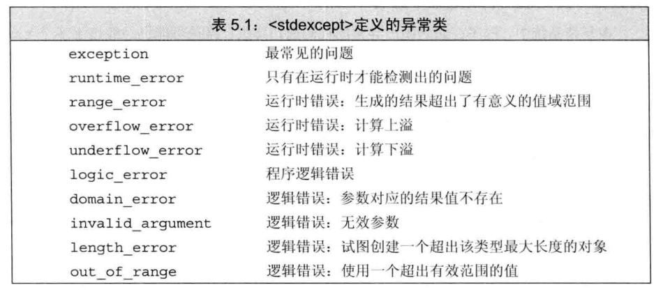

## 6 函数

### 6.1 函数基础

函数调用时，**主调函数(calling function)**的执行被暂时中断，**被调函数(called function)**开始执行

执行函数第一步是(隐式)定义并初始化**形参**

return语句1.返回return的值    2.将控制权移回主调函数

```c++
int f(void){} //显式定义空形参列表
```

#### 6.1.1 局部对象

static 局部静态对象

#### 6.1.2 函数声明

一次定义，多次声明，如果一个函数永远用不到，可以只有声明没有定义。

声明可以没有形参名字只有类型，但是为了使用者理解需要写上去

#### 6.1.3 分离式编译

没啥

### 6.2 参数传递

使用引用形参b来使函数在return a时改变b，等效return两个参数

参数 const int i，这样是顶层const

尽量使用常量引用

#### 6.2.4 数组形参

 ```c++
 // 这三个声明等价
 void p(int *);
 void p(int []);
 void p(int [10]);//维度表示我们的期望，实际不一定
 ```

为了确保不越界

+ 数组本身包含结束标记（比如空字符）
  + 遍历这个指针直到遇上标记
+ 标准库规范
  + 传递首元素和尾后元素的指针
+ 传递数组大小的参数

#### 6.2.5 main：处理命令行选项

```c++
int main(int argc, char *argv[]){}
// 或
int main(int argc, char argv[][]){}
// argc为size，有效参数为0-argc-1，第argc个一定是0
// argv 第一个是程序名或空字符串，最后一个是0
// 可选的实参从argv[1]开始
```

当main函数在可执行文件prog内

```shell
prog -d -o ofile data0
```


#### 6.2.6 含有可变形参的函数

为了编写能处理不同数量实参的函数

c++11提供两种方法

1. 实参类型相同时，传递initializer_list类型
2. 类型不同，编写可变参数模板


initializer_list对象中的元素永远是常量值，不能改变


调用方法


也可以包含其他实参


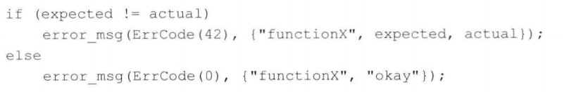

##### 省略符形参

为了便于c++程序访问c代码而设置，这些代码使用了varargs的c标准库功能，在c编译器文档中有使用方法

只用于c和c++通用类型


### 6.3 返回类型和return语句

#### 6.3.1 无返回值函数

void类型函数如果要return也只能在return时调用另一个void函数，图一乐的功能。

```c++
return p();//p是void函数
```

#### 6.3.2 有返回值函数

含有return语句的循环后面也要有一条return语句，如果没有那程序可能错误。

不要返回局部对象的引用或指针，除非是malloc或者new出来的？

c++11 允许函数返回{}包围的值的列表，可以用来初始化


main可以没有return，编译器会插入return 0

cstdlib里面有两个预处理变量可以表示成功或失败

return EXIT_FAILURE;

return EXIT_SUCCESS;

##### 声明一个返回数组指针的函数

```c++
// 使用类型别名
typedef int arrT[10];//arrT是别名，表示含有10个整数的数组
using arrT = int[10];//新写法更好一点
arrT* func(int i);//返回一个数组的指针

type (*func(params))[dimemsion];
//*func(params)表示函数的返回值解引用后可以按维度访问
```

##### 使用尾置返回类型

c++11 用于简化上面func声明

任何函数的定义都能使用，在本该出现返回类型的地方放一个auto

```c++
auto func(int i) -> int(*)[10]; //python并感
```

##### 使用decltype

如果知道函数返回的指针指向那种样子的数组，可以用decltype声明返回类型

```c++
int odd[] = {1.2,3}
decltype(odd) *arrptr(int i){}//相当于使用了一个类型的简写，和using、原生那种方式类似
```

### 6.4 函数重载

main函数不能重载

重载函数	形参列表	不能一样

只是省略了参数名，参数类型一样也不行

##### 重载和const形参

是否拥有顶层const的形参无法区分

```c++
int p(int a);
int p(const a);

int p(int *a);
int p(int *const a);
//第二条与第一条都等价
```

底层const可以区分

```c++
int p(int &a);
int p(const int &a);

int p(int *a);
int p(const int *a);
//不等价了
```

编译器优先匹配非常量版本

##### const_cast和重载

如果有一个参数和返回值都是const版本的函数，需要一参数和返回值都不是const的函数，可以在这个函数里面通过const_cast把参数转成const再调用const版本，然后把返回值转成非const再return，这样很安全。

#### 6.4.1 重载与作用域

在内层声明函数会覆盖外层函数，此时无法形成重载

c++名字查找发生在类型检查之前

所以先查找到内层的名字就截止，再判断是不是函数，这时候就发现自己找错了，但是晚了，如果先类型检查那么就会找到外层的函数，再匹配名字就成功，不过c++不是这么干的

### 6.5 特殊用途语言特性

#### 6.5.1 默认实参

int a(int b = 1);

有默认值的参数要写在最后面

函数声明中不能给参数重复分配默认实参，后续的声明只能给没有默认参数的形参添加默认值，并且添加的这个形参右侧的所有参数都要有默认值

局部变量不能作为默认实参

只要表达式类型能转换成形参的类型就能作为默认实参

#### 6.5.2 内联函数和constexpr函数

##### 内联函数

函数定义的时候加上inline（只在声明时加上inline好像没用）

> `inline`必须在函数定义时候使用，只在函数声明上使用没有任何作用（而且不应该在声明时使用`inline`）。

递归，有复杂流程，超过5行的函数不要声明成inline

inline是一种请求，编译器可以不理会，这时会给出警告

调用之前如果这个函数声明有inline或者已经被定义成inline就会生效，在调用之后才有inline声明那么inline就不生效

调试阶段所有内联函数都不被实现

定义在类声明之中的成员函数自动成为内联函数，所以最好把定义放在声明之外

内联用代码膨胀，占更多内存，避免调用开销

好的编译器会根据函数定义自动取消不值得的内联，所以inline不应该在函数声明的时候写。

##### constexpr函数

能用于常量表达式的函数，函数的返回类型和所有形参的类型都是字面量，函数体中有且只有一条return。

编译器把对constexpr函数的调用直接替换成结果。constexpr函数被隐式指定成内联函数。

函数体内可以包含其他语句，只要这些语句运行时不执行任何操作。比如空语句，类型别名（typedef），using声明。

constexpr函数不一定返回常量表达式，只有参数是返回值才是


内联函数和constexpr函数可以多次定义，因为文件分开编译时，编译器要展开函数需要函数定义，但是每次的定义必须完全一致，所以这两种函数通常**定义在头文件**中。

#### 6.5.3 调试帮助

assert（expr）；是预处理宏，也就是预处理变量

预处理名字由预处理器管理，所以不需要using直接使用

定义在cassert头文件中

预处理名字和宏名字一样不能重复，所以含有这个头文件的程序不能定义叫assert的变量函数等实体，即使没有直接包含cassert，include的别的头文件也可能包含，所以最好不要重复名字

NDEBUG预处理变量

#define NDEBUG

然后assert就不生效，避免了运行时开销。

```c++
// 编译器定义的局部静态变量
__func__ //存放函数名，每个函数都有，static const char
// 四个预处理器定义的调试用名字，都是字符串字面值
__FILE__ //文件名
__TIME__ //编译时间
__LINE__ //当前行号
__DATE__ //编译日期

#ifndef NDEBUG
    //在此处使用调试名字
#endif
```

### 6.6 函数匹配

如果存在有默认参数的重载函数，调用时缺失了那些有默认值的参数，这个函数也会被匹配

#### 6.6.1 实参类型转换

存在多个同级匹配，该调用就具有二义性

小整型会提升到int或者更大的整数类型，比如char会直接提升成int，不会变成short

所有算数类型转换的级别都相同，int转unsigned int和int转double级别相同。

### 6.7 函数指针

```c++
int (*pf)(params); //声明一个函数指针，未初始化
//*pf 一定要有括号，没有那么就声明了一个返回int*的新函数
pf = a;//给pf赋值，a函数参数返回值与pf完全一致
pf = nullptr;
```

函数形参也可以是函数指针，直接调用时输入函数名会自动转换成指针（妙）

声明


调用

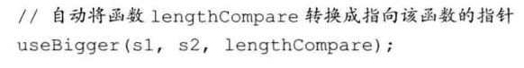

利用typedef 和decltype简化定义


decltype（函数）=函数，不是函数指针，需要手动转换


##### 返回指向函数的指针

```c++
// 声明函数指针
using f = int(int*,int);//函数
using pf = int(*)(int*,int);//函数指针
// 使用函数指针
pf f1(int);
f f1(int);//错误，不能返回函数
f *f1(int);//正确，f1返回函数，再转成指针

//直接声明f1
int (*f1(int))(int*, int);
auto f1(int) -> int(*)(int*, int);//尾置返回类型
```

## 7 类

 定义在类内部的函数是隐式的inline函数

函数内部直接访问类的成员，相当于隐式地通过this指针调用

this是指向常量的指针

类内一个对象调用另一个对象（函数使用变量或者调用函数），this指针在其中隐式地传递

常量对象即它的引用和指针只能调用常量成员函数

```c++
int A::p(int* a) const{
    //
}
// 在类外定义类内函数
```

#### 7.1.3 定义类相关的非成员函数

辅助函数可以帮助类操作，但是不属于类，比如add，read，print，如果非成员函数是类接口的组成部分，它们的声明就要和类放在同一个头文件内。

流操作


#### 7.1.4 构造函数

与类名相同，可以重载，没有返回类型，不能是const，因为知道构造函数完成初始化，对象才能真正取得常量属性，所以构造函数在const对象的构造过程中可以向它写值

默认构造函数由编译器创建，又叫合成的默认构造函数。

如果一个成员存在类内初始值，就用初始值，没有就默认初始化

如果存在内置类型和复合类型，这些值是未定义的，比如数组和指针。所以需要手动写构造函数

如果存在其他类的对象，但是那些类没有默认构造函数，那么就需要构造函数给这些类初始化

c++11 =default 设定默认函数

如果一个类已经声明了有参数的构造函数，编译器就不会给它创建默认无参构造函数，这时候可以加上

```c++
class/struct A{
    A(int a);
    A() = defalut; //手动指定默认构造函数，不需要在类外写函数体，编译器会自动生成；
};
```

默认函数需要是特殊的成员函数（默认无参构造函数，拷贝构造函数，析构函数）或者不能有默认参数

= default 定义在类内就是inline，定义在类外就不是inline

c++11 之前，在成员函数后面加上= delete可以手动弃用函数

**构造函数初始值列表**

```c++
class A{
    int a,b;
    // 构造函数使用传入的参数给类内变量初始化
    A(int m,int n):a(m),b(n){}
};
```

在构造函数初始值列表里面没有被初始化的成员变量会像默认构造函数一样被隐式初始化。

类内初始值很好，确保了每个成员都有一个正确的值，构造函数不应该轻易覆盖类内初始值，除非给了他一个新的值。

#### 7.1.5拷贝、赋值和析构

合成的拷贝赋值和销毁只适用于普通成员，如果成员需要分配类对象之外的资源，比如内存，就会失效。

### 7.2 访问控制与封装

public: protected: private:

class默认private，struct 默认public，唯一区别就是默认权限不同

#### 7.2.1 友元

类的辅助函数read、print、add需要访问类内成员，所以要声明友元

```c++
class A{
    friend int a(..){};//类内友元声明
};
```

虽然在类内出现的具体位置不限，但是最好在最开始或者最结束声明

### 7.3 类的其他特性

#### 7.3.1 类内成员再探

类内成员函数在类内类外都可以定义成inline，inline函数的定义和类的定义都应该放在头文件中

**可变数据成员**

永远不是const，即使是const对象的成员，通过这个方法可以在const成员函数里面修改它的值。

```c++
class A{
    mutable int a;
    void p() const;
};
void A::p() const{
    ++a;
}
const A test;
test.p();//const对象的const函数也能修改值
```

**类数据成员的初始值**

```c++
class A{
    std::vector<int> a{1,2,3};
}//通过=或者列表初始化创建初始值
```

#### 7.3.2 返回*this的成员函数

函数的返回值是引用，所以直接返回了这个对象

#### 7.3.3 类类型

```c++
//两种声明等价
class A a;
A a;

//类的声明定义也能分开
class A; //只声明不定义
```

这种声明叫做前向声明（forward declaration），在声明之后定义之前这个类型是不完全类型。

对于不完全类型，可以定义这种类型的指针或引用，可以声明（但不能定义）以这种类型为参数或返回值类型的函数。

因为类被定义之后编译器才能知道这个类的对象所占的内存，所以类的定义中不能包含自己的对象。但是类名字出现了就是声明过了，所以类可以包含自己对象的引用或者指针。

#### 7.3.4 友元再探

##### 类之间的友元关系

友元类

```c++
class A{
	friend class B;
	friend int B::p();//也可以只声明类中的一个函数
};
```

B的成员函数可以访问A的所有成员，等同于把B的所有函数声明成友元函数

友元函数的参数是声明它为友元的类，这个函数可以直接访问参数的private、protected对象

在上面例子中声明p是友元应该按如下顺序写代码

1. 定义B，在B中声明p
2. 定义A，声明p是友元
3. 定义p

B放出个诱饵给A咬，A咬了再拉线

##### 友元声明和作用域

类和非成员函数的声明不是必须在友元声明之前，友元没有声明类也可以声明友元，只不过此时假定了友元在当前作用域可见。

A声明友元函数p，可以直接在类内部把p给定义了，但是这样定义并不算声明，需要在类外声明一下，如果不声明直接在A内部使用p，那么p就是未声明的。

定义不声明的例子

### 7.4 类的作用域

如果类里面函数使用的返回类型在类里面定义，那么在类外定义这个函数的时候，返回类型也需要带上作用域操作符

#### 7.4.1 名字查找与类的作用域

编译器处理完类中的全部声明之才会处理成员函数的定义

所以类中的函数可以使用类中所有其他函数

##### 类型名要特殊处理

内层作用域一般可以重新定义外层作用域中的名字，即使在重新定义之前这个名字已经被使用了

但是在类中，如果一个名字已经被使用过，那么这个名字就不能被重新定义，即使定义和原来的定义完全一致

所以一般在类定义的开头重新定义名字。

##### 成员定义中的普通块作用域的名字查找

1. 在成员函数内查找这个名字的声明

2. 在类内查找这个名字（所有名字都被考虑）

3. 在成员函数定义之前的作用域内继续查找

   成员函数可以在类外定义，所以这个作用域就是类外作用域，类定义之前     类定义之后这个函数定义之前

一般不建议使用其他成员的名字作为某个成员函数的参数名。

如果函数参数叫a，类内成员也叫a，此时a就是参数，类内成员是this->a

如果类外也有个a（全局a），就是	==::a==

### 7.5 构造函数再探

#### 7.5.1 构造函数初始值列表

当没有给类内的变量初始化，只是做了个定义。

如果构造函数初始值列表中没有显式地给a初始化，那么a在执行构造函数之前被默认初始化。

##### 构造函数初始值有时必不可少

比如引用类型和const，必须初始化

1. 使用类内初始值
2. 使用构造函数初始值列表

建议所有数据成员都初始化，效率高，且一些数据成员必须被初始化，特别是有的类含有<u>需要构造函数初始值的</u>成员

##### 成员初始化的顺序

构造函数初始值列表不限定顺序，只说明哪些被初始化了

成员初始化顺序取决于在类定义中出现的顺序

```c++
class A{
    int i;
    int j;
public
    A(int x): j(x),i(j){ } //错误，i先定义，不能用j给i赋值
};
```

有的编译器在构造函数初始值列表中顺序和类定义中的顺序不符时会警告

最好顺序一致，且不用一个成员初始化另一个成员，最好都用构造函数参数给成员初始化

构造函数可以提供默认实参，就相当于定义了默认构造函数

#### 7.5.2 委托构造函数

c++11

委托构造函数使用它的类的其他构造函数执行它的初始化过程

把自己的部分或者全部职责委托给了其他构造函数

```c++
class A{
    int a,b,c;
    A(int a1,int b1,int c1): a(a1),b(b1),c(c1){}
    //委托构造函数
    A(): A(0,0,0){}
    A(int a1): A(a1,0,0){}
    A(std::istream &is): A(0,0,0){read(is, *this)}
};
```

#### 7.5.3 默认构造函数的作用

当对象被默认初始化或值初始化时自动执行默认构造函数

默认初始化在以下情况发生

1. 在块作用域内不使用任何初始值定义一个非静态变量或数组
2. 当一个类本身含有别的类的成员，并且使用了合成的默认构造函数
3. 当类类型的成员没有在构造函数初始值列表中显式地初始化

值初始化在以下情况下发生

1. 数组初始化过程中提供的初始值数量小于数组大小
2. 不使用初始值定义一个局部静态变量
3. 通过书写形如T()的表达式显式地请求值初始化，其中T是类型名，比如vector的一个构造函数只接受一个实参用于说明vector大小，对它的元素初始化器进行值初始化。

```c++
A a();//声明函数而不是创建对象;
A a;//创建了对象，且使用了默认构造函数
```

#### 7.5.4 隐式的类类型转换

如果构造函数只接受一个实参，那它实际上定义了转换为此类类型的隐式转换机制，这种构造函数叫**转换构造函数**

能通过一个实参调用的构造函数定义了一条从构造函数的参数类型向类类型隐式转换的规则

类似于一个接受父类的函数也能接收子类

一个接收类的函数也能接受类构造函数的参数

会先生成一个临时的类，然后当参数传入，在函数调用完成后被丢弃

##### 只允许一步类类型转换

编译器只会自动执行一步类型转换

A类接收string构造，如果给接收A的函数传递char*参数是不行的，因为包含了两次转换

##### 类类型转换不是总有效

创建的临时对象可能不具有实际意义

##### 抑制构造函数的隐式转换

把构造函数声明成explicit

```c++
class A{
public:
    explicit A(string a){}
}
```

explicit只对一个实参的构造函数有效，多余一个实参的构造函数不能用于执行隐式转换。

在类外定义不应重复explicit

##### explicit 构造函数只能用于直接初始化

```c++
string t("111");
A a(t); //可以直接初始化
A a = t; //不能用于拷贝形式的初始化
```

##### 为转换显式地使用构造函数

```c++
combine(static_cast<A>(t)); //强转
combine(A(t)); //匿名对象
```

#### 7.5.5 聚合类

聚合类使得用户可以直接访问其成员，并且具有特殊的初始化语法

聚合类满足的条件

1. 成员都是public
2. 没有任何构造函数
3. 没有类内初始值
4. 没有基类，没有virtual函数

可以使用列表初始化

列表元素太少，靠后成员被值初始化

缺点

1. 所有成员都是public
2. 用户不能正确初始化每个成员，忘了某个初始值或者提供不恰当初始值
3. 添加或删除一个成员后，所有初始化语句都需要更新

##### 7.5.6 字面值常量类

constexpr函数参数和返回值必须是字面值。

除了算数类型、引用和指针，某些类也是字面值类型，它们可能含有constexpr函数成员，这样的成员必须符合costexpr函数的所有要求，它们是隐式const的

数据成员都是字面值类型的<u>聚合类</u>是字面值常量类。

如果一个类不是聚合类，符合以下要求也是字面值常量类

1. 数据成员都是字面值

2. 至少含有一个constexpr构造函数

3. 如果数据成员含有类内初始值，则内置类形成员的初始值必须是常量表达式。（是不是类内初始值必须是常量表达式？）

   或者如果成员属于某种类类型，则初始值必须使用成员自己的constexpr构造函数

4. 类必须使用析构函数的默认定义，该成员负责销毁类的对象

##### constexpr构造函数

构造函数不能是const的，但是字面值常量类的构造函数可以是constexpr函数

constexpr构造函数可以声明成 = default 或者 = delete

constexpr构造函数必须符合

+ 构造函数要求（不能包含返回语句）
+ constexpr函数要求（唯一可执行语句是返回语句）

所以constexpr构造函数一般是空的

```c++
class A{
public:
    int a;
    constexpr A(int t):a(t) { }
}
```

constexpr构造函数必须初始化所有数据成员，初始值或者使用constexpr构造函数，或者是一条常量表达式。

constexpr构造函数用于生成constexpr对象以及constexpr函数的参数或返回类型。
### 7.6 类的静态成员

类静态成员也没有this指针

 ```c++
 class A{
     static int a;
 }
 ```

普通成员函数里面的static变量也只有一个

类对象可以直接访问静态成员

类外可以通过作用域操作符访问

A::a;

类外定义静态函数不能重复static关键词，和explicit一样

静态数据成员不属于任何一个对象，所以不是在创建类的对象时被定义的。

不能在类内初始化静态成员，在类外定义和初始化每个静态成员。

##### 静态成员的类内初始化

```c++
//静态成员如果是constexpr就可以在类内初始化
static constexpr int period = 30;
```

即使在内部被初始化了，也应该在类外定义一下

##### 静态成员能用于某些场景，普通成员不能

静态成员独立于任何对象，所以类可以包含自己的静态成员对象

可以使用静态成员当默认实参

```c++
class A{
    int c(A = a); //a是在类中稍后定义的静态成员
public:
    static A a;//可以
    A b;//不行
}
```

非静态数据成员不能作为默认实参，因为它的值本身属于对象的一部分，这么做的结果是无法真正提供一个对象来从中获取成员的值。

> C++的默认参数是在编译期间实现的，所以必须使用常量或者在编译期就能确定的地址（静态成员），this指针和非静态成员在编译器是不能确定地址的，无法作为默认实参。

## 8 IO库

### 8.1 IO类


支持使用宽字符的语言（使用wchar_t类型），类型和函数的名字以w开头

wcin，wcout，wcerr

由于继承机制，标准库流特性可以无差别地应用于普通流，文件流和string流，char或宽字符流

#### 8.1.1 IO对象无拷贝或赋值

不能对流对象赋值，初始化参数，拷贝

所以形参或返回类型不能是流，只能是流的引用。

读写IO对象会改变状态，所以传递和返回的引用不能是const

#### 8.1.2 条件状态


流如果读到错误类型数据，比如cin>>a，a是int，输入string，或是eof就会进入错误状态。

```c++
while(cin >> a){
    //读操作成功，流有效
}
```

##### 查询流的状态

IO库定义了四个iostate类型的constexpr值，可以通过&来使用

**badbit**：系统级错误，一旦发生流就无法使用（比如不可恢复的读写错误）

**failbit**：可恢复错误，（读取类型与预期不同）

**eofbit**：到达文件末尾，eofbit和failbit都置1

**gootbit**：流未发生错误

标准库提供了.good()，.bad()，.fail()，.eof()检测对应位置

badbit被置位时，fail也会返回true，所以判断流总体是否正确应该使用.good()和.fail()，其余两个表示特定错误。

##### 管理条件状态

```c++
auto old_stat = cin.rdstate();//获得当前状态
cin.clear();//无参数版本， 清除所有错误
cin.setstate(old_stat); //恢复状态
//复位failbit和badbit，其他标志位不变
//clear的带参数版本
cin.clear(cin.rdstate() & ~cin.failbit & ~cin.badbit);
```

#### 管理输出缓冲

缓冲刷新的原因

1. 程序结束

   ​	main函数return操作的一部分，缓冲刷新被执行

2. 缓冲区满

3. endl之类的操纵符

4. 每个输出之后使用unitbuf操纵符设置流的内部状态清空缓冲区

   ​	cerr默认设置了unitbuf，所以写入cerr的内容都是立即刷新

5. 一个输出流可能被关联到另一个流，当读写那个被关联的流，那个流的缓冲区就被刷新。

   ​	默认情况下，cin，cerr都关联到cout，读cin或写cerr都会导致cout刷新缓冲

##### 刷新输出缓冲区

三个操纵符

+ endl，多输出一个换行，刷新
+ flush，直接刷新无字符
+ ends，多输出一个空字符，刷新

##### unitbuf 操纵符

```c++
cout << unitbuf;// 所有输出立即刷新
cout << nounitbuf; //回到正常的缓冲
```

程序崩溃了输出不会刷新，所以调试一个已经崩溃的程序可以设置unitbuf或者使用cerr输出调试信息

##### 关联输入和输出流

标准库cout和cin、cerr关联起来

cin>>ival;会导致cout刷新

交互式系统应该关联输入流和输出流，可以使得所有输出都会在读之前被打印出来。

**tie函数**

不接受参数，或者接受一个输出流指针

```c++
cin.tie();//返回当前关联的流
cin.tie(&cout);//关联到cout（默认就关联了）
// 关联到新的流会返回以前关联的流old_tie
auto *old_tie = cin.tie(nullptr); //cin不关联任何流
```

### 8.2 文件输入输出

ifstream：读

ofstream：写

fstream：读写


#### 8.2.1 使用文件流对象

和fstream一样重载了三种创建方式

##### 用fstream代替iostream&

一个iostream对象的引用或指针的参数，可以传fstream(或sstream)对象

原来是对象指针，现在直接传对象

未绑定对象可以.open

.close关闭文件，可以打开另一个文件

if(fstream对象) //判断open是否成功

#### 8.2.2 文件模式


+ trunc依赖out
+ 只要trunc没设定，就可以设定app，app默认out
+ 即使没有指定trunc，out模式打开文件也会截断，如果需要保留内容需要指定app，或者同时制定in模式
+ ate，binary可用于任何类型，与任何模式组合

fstream默认in，ofstream默认out，fstream默认in out

##### out模式丢弃已有数据

##### 调用open会确定文件模式

### 8.3 string流


#### 8.3.1 使用istringstream

适用于处理行内某个单词


通过getline读取一行，转成istringstream对象，用流的方式处理string

#### 8.3.2 使用ostringstream

希望逐步编写，一起打印

## 9 顺序容器

[顺序容器和关联容器的区别](./杂乱的知识点/顺序容器和关联容器.md)

### 9.1 顺序容器概述


string和vector存储在连续的内存

c++新标准增加了array和forward_list

array比内置数组更安全，更容易使用，大小固定，不支持添加和删除元素以及改变容器大小

forward_list设计目标是达到最好的手写的单向链表数据结构相当的性能，所以不支持size操作

其他容器的size操作都是O(1)

##### 确定使用哪种顺序容器

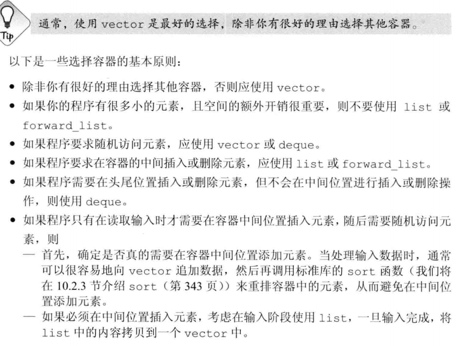

如果不确定需要哪种容器，比如又要随机访问，又要在中间位置插入元素，可以只用vector和list公共的操作（迭代器），这样方便重构

### 9.2 容器库概览

##### 对容器可以保存的元素类型的限制


#### 9.2.1 迭代器

forward_list的迭代器不支持递减运算符(--)

##### 迭代器范围

就是begin end迭代器，end迭代器指向尾元素之后的位置，迭代器范围的元素包含first表示的元素到end之前的所有元素

左闭右开

```c++
while(begin != end){
    //操作
    ++begin;
}
```

#### 9.2.2 容器类型成员

反向迭代器的++是获得上一个元素，逆序前进

**类型别名**可以在不了解容器中元素类型的情况下使用它

#### 9.2.3 begin和end成员

r版本返回反向迭代器，c版本返回const版本


a是常量对象那么.begin也返回const迭代器

不需要写数据就应使用const版本

#### 9.2.4 容器定义与初始化


##### 与顺序容器大小相关的构造函数

顺序容器特有的构造函数，关联容器不能初始化大小

array不支持


##### 标准库array具有固定大小

```c++
//不仅要指定类型，还要指定大小
array<int, 42> a;
array<int, 42> a = {1,2,34,5};
array<int, 42> a = {42};//只有第一个是42
array<int, 42> b = a;//只有类型大小都相同才能赋值
```

#### 9.2.5 赋值和swap

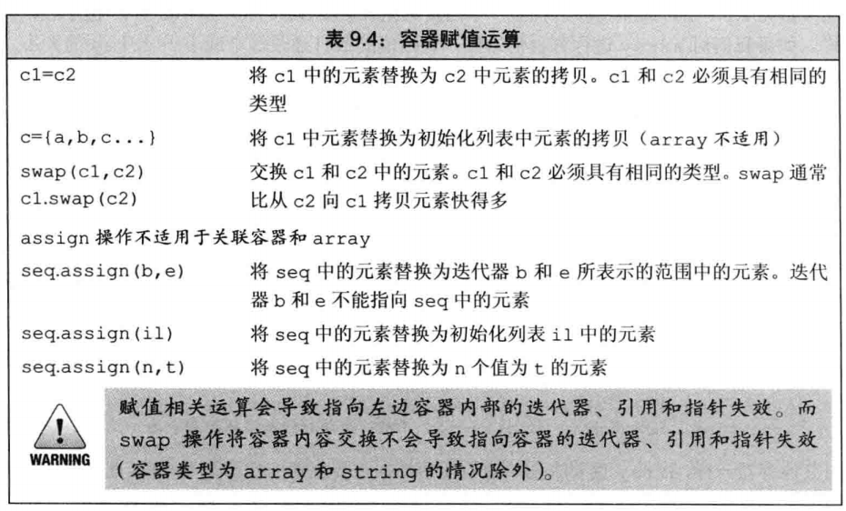

普通容器的赋值，左边容器大小会等于右边容器

array只有两边容器大小类型都相同才能赋值

##### 使用assign（关联容器和array不行）

可以从另一个不同但相容的类型赋值，或者从容器的一个子序列赋值，使用参数指定元素的拷贝替换左边的所有元素。可以用assign使用vector中的char* 给list中的string赋值

由于旧元素被替换了，所以参数不能是自己的迭代器

第二个版本接受一个整形和一个默认值

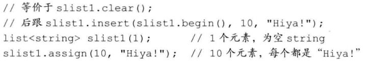

##### 使用swap

swap(a1,a2); 交换两个相同类型容器的内容

除了array，其他容器都是O(1)，只交换了索引

array会全部交换

**指针引用迭代器**

其他容器也会交换，不会失效

string的会失效

array不会交换，不会失效，只是值变化

swap既有成员版本，又有非成员版本，早期只有成员版本

优先使用非成员版本

#### 9.2.6 容器大小操作

.size() .empty()  .max_size()

forward_list不支持size()

#### 9.2.7 关系运算符

关系运算符两边只能是保存相同元素类型的相同类型容器

容器类型都支持==和!=

除了无序关联容器都支持>、<、>=、<=

比较两个容器实际上是元素的逐对比较、类似string比较


 ##### 容器的关系运算符使用元素的关系运算符完成比较

只有元素类型也定义了相应的比较运算符，才可以使用它来比较容器

### 9.3 顺序容器操作

#### 9.3.1 向顺序容器添加元素


c++11 新标准 emplace_front、emplace、emplace_back

这些操作是构造元素而不是拷贝元素

把参数传递给元素类型的构造函数，直接在容器管理的内存空间中构造元素

#### 9.3.2 访问元素


返回的都是引用，所以可以直接赋值

##### 下标操作和安全的随机访问

使用**at运算符**，如果下标越界会抛出一个out_of_range异常

```c++
a[0]; //运行时错误，a中无元素
a.at(0);// 抛出异常
```

#### 9.3.3 删除元素

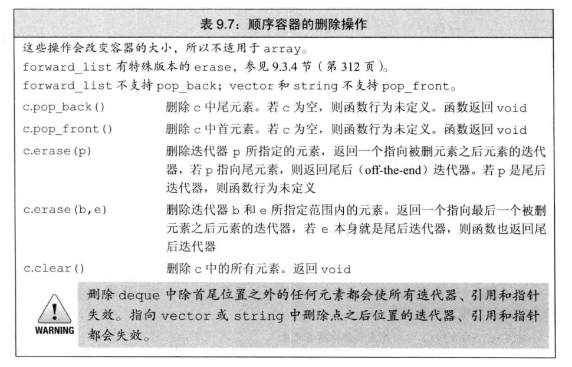

一般使用it = lst.erase(it);	重置迭代器

删除了迭代器当前位置的元素，那么迭代器此时是什么状态？

> 根据使用的容器类型来看，如果是关联容器(map,set,multimap,multiset,...)，仅仅会使当前iterator失效。
>
> 如果是顺序容器(vector,string,list,deque,...)，iterator可能会变成野指针，++、--和解引用都会非法访问内存。

#### 9.3.4 特殊的forward_list操作

对于链表，添加或删除一个元素需要访问前驱节点来更改它指向的后继，由于forward_list是单向链表，不能访问前驱，所以添加或删除元素是通过改变给定元素之后的元素来完成的。


判断并删除元素需要保存两个迭代器，一个指向当前，一个指向当前的前驱

当判断当前需要删除，调用	当前=lst.erase_after(前驱)，然后继续遍历，不需要删除直接当前和前驱都++

#### 9.3.5 改变容器大小


#### 9.3.6 容器操作可能使迭代器失效

添加元素

+ string和vector如果空间重新分配了那么迭代器引用指针都会失效，未重新分配则插入位置之后的迭代器指针引用失效
+ deque，插入到除了首尾位置之外的地方会导致三个失效，在首尾插入，只有迭代器会失效
+ 对于list和forward_list，添加元素之后仍然有效

删除元素

+ vector和string被删元素之前三者有效，后面的三者无效
+ deque，删除首尾之外元素，三者无效
  + 删除尾，尾后迭代器失效
  + 删除头，都有效
+ 对于list和forward_list，仍然有效

##### 编写改变容器的循环程序

使用insert和erase，用函数的返回值更新迭代器

##### 不要保存end返回的迭代器

更改删除vector和string以及除了deque中首元素之外的其他位置，end返回的迭代器都会失效，所以需要反复调用end。

还好end操作都很快

### 9.4 vector对象是如何增长的

vector和string会分配比需求更大的空间做备用。这样扩张时通常比list和deque还快

##### 管理容量的成员函数


reserve不改变容器中元素的数量，仅仅影响预先分配的空间

调用reserve(n)后，capacity()会大于等于n

9.3.5的resize只是改变容器中元素个数，不改变容量

新标准的shrink_to_fit表示我们不需要多余的内存，但是具体实现可以忽略此请求，所以也不保证一定退回内存空间，仅仅是一次请求。

##### capacity和size

size是已经保存的元素数目

capacity是不分配新内存空间的前提下最多可以保存多少元素

### 9.5 额外的string操作

除了顺序容器共同的操作，string类型特有的操作，大部分都是string类和c风格字符串的转换，要么是用下标代替迭代器的版本

#### 9.5.1 构造string的其他方法


##### substr操作


#### 9.5.2 改变string的其他方法

额外的insert和erase，原版的迭代器替换成下标

insert和assign也可以接受c风格字符串

##### append和replace函数

append可以在string末尾插入


#### string搜索操作


#### 9.5.4 compare函数


#### 9.5.5 数值转换

字符串中表示数值的字符和真实数值转换


### 9.6 容器适配器

适配器是一种机制，让某种事物的行为看起来像另一种事物

一个容器适配器接受一种已有的容器类型，使其行为看起来像另一种类型


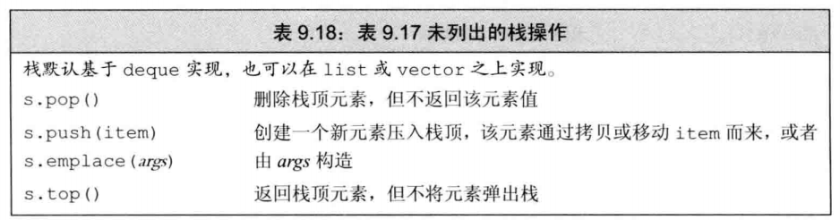

##### [容器适配器讲解](http://c.biancheng.net/view/6967.html)

stack 栈适配器、queue 队列适配器以及 priority_queue 优先权队列适配器


stack容器适配器的创建（queue也一样）

```c++
stack<int> s1;//使用默认的基础容器deque
stack<int,list<int>> s2;//使用list当基础容器
//初始化
stack<int,list<int>> s2 = s1;
stack<int,list<int>> s2(s1);
```

priority_queue容器适配器的创建

优先队列让优先级高的排在前面，优先出队

```c++
//前两个参数不变，第三个是排序规则
//默认使用std::less<T>按照元素值从大到小进行排序，还可以使用std::greater<T>按照元素值从小到大排序，但更多情况下是使用自定义的排序规则。
std::priority_queue<int, std::deque<int>, std::greater<int> > copy_values(values, values+4);//{1,3,2,4}
```

这三个都没有迭代器


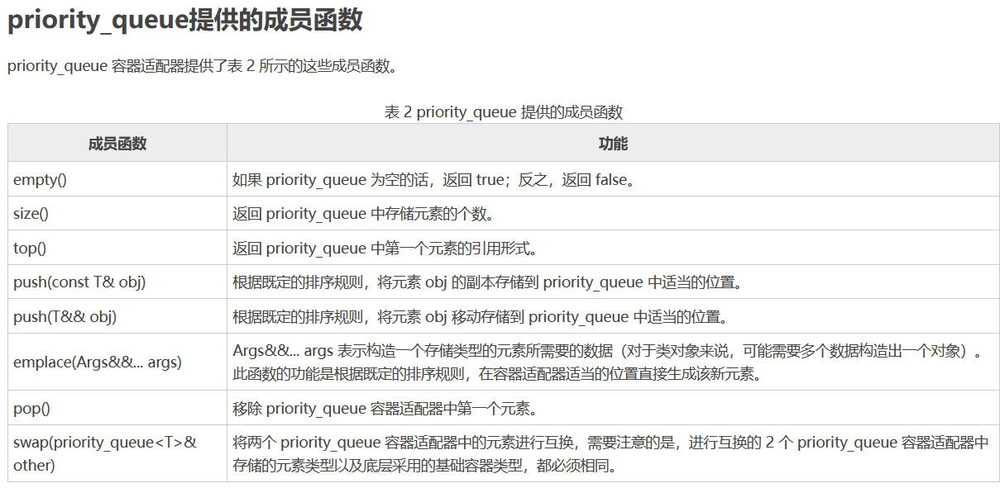

## 10 泛型算法

标准库处理容器的方法

### 10.1 概述

大多数定义在algorithm

numeric中定义了一组数值泛型算法

这些算法不直接操作容器，而是遍历由两个迭代器指定的元素范围来进行操作

算法不依赖于容器，只依赖于元素类型

不执行容器操作，只执行迭代器操作，所以不会改变容器大小

但是存在特殊的迭代器，比如插入器（inserter），给这类迭代器赋值会在底层容器上执行插入操作。

### 10.2 初识泛型算法

#### 10.2.1 只读算法

不改变元素，比如find()，count()，accumulate()

```c++
int sum = accumulate(vec.cbegin(), vec.cend(), 0);// 0是和的初值
```

##### 算法和元素类型

算法接收的元素类型一定要支持对应的运算符，比如accumulate的第三个参数一定有+操作

##### 操作两个序列的算法

只接受一个单一迭代器表示第二个序列的算法，都假定第二个序列至少和第一个序列一样长

#### 10.2.2 写容器元素的算法

算法通常不会改变容器大小，只操作输入迭代器范围的元素，是安全的

##### 算法不检查写操作

向目的位置迭代器写入数据的算法假定目的为止足够大，能容纳要写入的元素。

##### 介绍back_inserter

插入迭代器（insert iterator）

back_inserter函数，定义在iterator头文件

```c++
vector<int> vec;
auto it = back_inserter(vec);//接受一个引用，返回一个插入迭代器
*it = 1;//插入1
fill_n(back_inserter(vec), 10, 0);//使用插入迭代器可以对空容器写
```

##### 拷贝算法

copy(begin,end,tar);

#### 10.2.3 重排容器元素的算法

sort(begin,end);

unique(begin,end); 消除相邻重复项，返回一个指向不重复值后面的迭代器。只是覆盖重复元素，不会删除，所以返回的迭代器后面仍然是原来的内容。（书上写的是不知道值是什么，此处是我猜的）

##### 使用容器操作删除元素

得到了算法返回的迭代器，再使用容器操作

### 10.3 定制操作

使用自己定义的操作来代替默认运算符

#### 10.3.1 向算法传递函数

 sort第二个版本，接受第三个参数：谓词

##### 谓词

可调用的表达式，返回一个能用做条件的值

一元谓词，接受一个参数，二元谓词接受两个

```c++
bool isShorter(const string &s1, const string &s2){
    return s1.size() < s2.size();
}
sort(words.begin(), words.end(), isShorter);
```

##### 排序算法

stable_sort()，稳定排序算法，维持相等元素的原有顺序

#### 10.3.2 lambda表达式

##### 介绍lambda

如果可以对一个对象使用调用运算符，这个对象就是**可调用**的

1. 函数和函数指针
2. 重载了括号运算符的类
3. lambda表达式

```c++
[capture list](parameter list) -> return type {function body};
[](){return true;}//最简单的lambda
```

capture list捕获列表是一个lambda所在函数中定义的局部变量列表，通常为空

return type，parameter list，function body和普通函数一样

+ 必须使用尾置返回类型
+ 不能有默认参数，所以调用的实参数目等于形参数目

##### 向lambda传递参数

和普通函数一样直接调用

##### 使用捕获列表

捕获列表里面放的是lambda所在函数的**局部非static变量**，当前函数定义了a，创建lambda，a被捕获，lambda内部就能使用a

find_if、for_each算法

lambda可以直接使用当前函数之外的名称，比如cout，只要所在函数的作用域中包含了cout的定义就能用

捕获列表只用于**局部非static变量**，其余变量都能直接使用

#### 10.3.3 lambda捕获和返回

定义一个lambda，编译器生成一个与lambda对应的新的未命名的类类型，可以这样理解

传递一个lambda，同时定义了一个新类型和该类型的一个对象，传递的参数就是次编译器生成的类类型的未命名对象。

使用auto定义一个lambda初始化的变量时，定义了一个从lambda生成的类型的对象

默认情况下，从lambda生成的类都包含一个对应该lambda所捕获的变量的数据成员。类似任何普通类的成员函数，lambda的数据成员也在lambda对象创建时被初始化。

##### 值捕获

类似参数传递，变量的捕获方式可以是值或引用

值捕获必须变量可以拷贝。

被捕获的变量的值实在lambda创建时拷贝，而不是调用时拷贝。


创建完，捕获就结束了， 所以修改v1也不会影响

##### 引用捕获


引用捕获之后，在lambda执行的时候需要保证被引用对象仍然存在，所以引用了局部变量的lambda离开这个函数就无效了

可以引用捕获输入输出流

应该避免捕获指针或引用（不是引用捕获，是捕获引用）

##### 隐式捕获

除了显示列出来需要捕获的变量，还可以让编译器根据lambda体中的代码推断要使用的变量。捕获列表中放一个=或&表示推断。

```c++
[=](){return sz;};//值捕获sz
[&](){return sz;};//引用捕获sz
[=,a](){return {sz,a}}//混合使用
```

##### 可变lambda

默认lambda使用值捕获时，之后在lambda函数体内，使用被值捕获的变量时，该变量值将永远是其被捕获时，被lambda看到的值，一般这个值是无法改变的。
 **如果加上mutable，则会使得该“值捕获变量”的值，可以在被捕获的值的基础上进行变化。**

多次调用lambda函数对捕获变量值，所造成的改动会被累积。这是由于lambda函数其实也是一种类

```c++
auto f=[v1](A a) mutable -> B{...}
```

#### 10.3.4 参数绑定

如果lambda捕获列表为空，一般可以用函数代替

##### 标准库bind函数

c++11

```c++
//接受一个可调用对象，返回一个新的可调用对象
auto newCallable = bind(callable, arg_list);
//arg_list是逗号分割的参数列表，调用newCallabe会使用arg_list调用callable，arg_list可以使用字面值或普通参数或者占位符参数，这些参数形如_1,_2...
//所以可以改变原来参数的位置或者增加默认值
//用bind设定参数取代lambda里面的捕获参数
```

##### 使用placeholders名字

占位符名字_n，定义在placeholders命名空间中，这个命名空间定义在std

##### bind参数

可以使用bind修正参数的值

```c++
auto g = bind(f,a,b,_2,c,_1);
g(x,y)相当于f(a,b,y,c,x);
```


##### 绑定引用参数

bind中的普通参数是拷贝，因为流不能拷贝，所以无法作参数

使用标准库**ref**函数

```c++
bind(print,ref(os),_1);
```

ref()返回一个对象，包含给定值的引用，这个对象可以拷贝

cref()生成一个保存const引用的类

都定义在functional中

### 10.4 再探迭代器

除了为每个容器定义的迭代器，iterator还有

1. 插入迭代器
2. 流迭代器
3. 反向迭代器
4. 移动迭代器：用于移动元素而不是拷贝

#### 10.4.1 插入迭代器

插入器是一种迭代器适配器

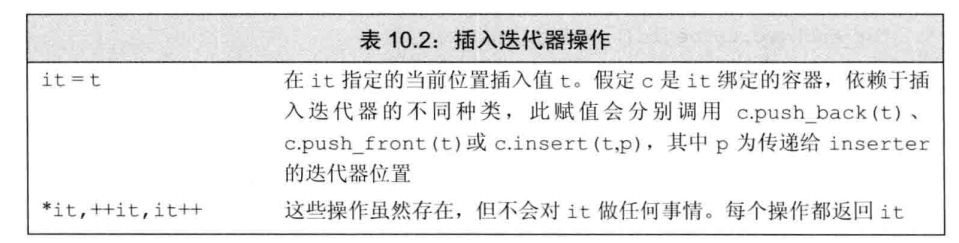


#### 10.4.2 流迭代器

##### istream_iterator


##### istream_iterator允许使用懒惰求值

使用流迭代器绑定到一个流，标准库不保证迭代器立即从流读取数据，具体实现可以推迟从流中读取数值，知道使用迭代器才真正读取。

只是保证第一次解引用迭代器时，从流中读取数据的操作已经完成。

##### ostream_iterator


##### 使用流迭代器处理类类型

可以为任何定义了>>的类创建istream_iterator

同理为任何定义了<<的类创建ostream_iterator

#### 10.4.3 反向迭代器

##### 反向迭代器需要递减运算符

只能从同时支持++和--的迭代器来定义反向迭代器

##### 反向迭代器和其他迭代器间的关系

没看懂

> 理解为把其他迭代器的++操作重新定义为--，--重新定义为++。

### 10.5 泛型算法结构

算法要求的迭代器


#### 10.5.1 5类迭代器

需要根据算法所需迭代器的特点选择符合要求的迭代器，传递错误类别的迭代器，很多编译器不会警告或提示

#### 10.5.2 算法形参模式


dest：目的位置，比如插入迭代器和输出流迭代器

##### 接收单个目标迭代器的算法

向输出迭代器写入数据的算法都假定目标空间足够容纳写入的数据

##### 接受单独的beg2的算法假定从beg2开始的序列与beg和end所表示的范围至少一样大

#### 10.5.3 算法命名规范

##### 一些算法使用重载形式传递一个谓词

有的算法（比如unique）支持自定义谓词参数来代替<或==操作

##### _if版本的算法

接受一个元素值的算法通常有一个不同名的版本，用来接收谓词代替元素值。接受谓词参数的算法都有附加的_if前缀


##### 区分拷贝元素的版本和不拷贝的版本

重排元素的算法将重拍后的元素写回给定的输入序列，

_copy版本，将元素写到一个指定的输出目的位置

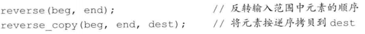

一些算法同时提供_copy和\_if版本


### 10.6 特定容器算法

通用版本 的sort要求随机访问迭代器，因此list和forward_list不能用

list提供双向迭代器，forward_list提供前向迭代器

链表版本的其他算法交换输入序列中元素的链接，普通版本算法直接交换输入序列中元素，链表也能用但是效率低


**链表优先使用自带的算法**

##### splice成员

链表特有的splice算法，链表的截取拼接操作


##### 链表特有的操作会改变容器

链表特有版本和通用版本算法的区别是链表版本会改变底层容器

比如remove和unique的链表版本会直接删除元素，merge和splice会销毁参数

## 11 关联容器

关联容器使用关键字来保存和访问

标准库的8个关联容器的区别

1. 不是map就是set
   + map存键值对
   + set只存键
2. 关键字是否允许重复
   + 允许重复的容器名字都有multi
3. 有序或是无序保存
   + 无序保存名字中都有unordered


### 11.1 使用关联容器

```c++
map<string,size_t> word_count;
word_count["11"];//直接访问不存在的key，value会被默认初始化（我猜）
set<string> temp;
```

### 11.2 关联容器概述

#### 11.2.1 定义关联容器

c++11新标准，可以对关联容器进行值初始化


##### 初始化multimap和multiset

```c++
set</*元素类型*/,/*比较函数指针*/> temp(/*比较函数名*/);
```

使用函数名会自动转化为函数指针

允许关键字重复

使用迭代器初始化普通set，重复元素会被忽略，multiset不会忽略

#### 11.2.2 关键字类型的要求

有序容器（map、multimap、set、multiset）关键字类型必须定义元素的比较方法

可以自定义比较方法

##### 有序容器的关键字类型

向容器所提供的比较操作必须在关键字类型上定义一个严格弱序(类似小于等于)


满足反对称、传递、以及等价

所以一个类定义了一个正常的<运算符，就可以用作关键字

##### 使用关键字类型的比较函数

比较函数适用的类型一定要和关键字类型吻合

自定义运算符初始化的时候，需要指定运算符函数


#### 11.2.3 pair类型

定义在utility中

1个pair保存两个数据成员

pair像容器，是用来生成特定类型的模板


可以当函数返回值

```c++
return pair<T1,T2>(a,b);
return make_pair(a,b);
return {a,b};//c++11列表初始化
```

### 11.3 关联容器操作


关键字无法改变，都是const


#### 11.3.1 关联容器迭代器

 解引用一个关联容器迭代器，会得到一个类型为value_type的值的引用

##### set的迭代器是const的

无法改变set中元素，因为set中的关键字是const

##### 遍历关联容器

begin和end操作

取出顺序按照字典序

##### 关联容器和算法

一般不对关联容器使用泛型算法

支持的算法不能修改或重排容器，只能只读

但是这类算法需要搜索序列，由于关联容器不能通过关键字快速查找，所以效率低。但是关联容器的算法成员效率比普通算法高。和链表一样优先使用自带的算法

#### 11.3.2 添加元素

insert成员，插入一个已经存在的元素对容器没有任何影响，不会报错，map不会更新同key的value

##### 向map添加元素


 

##### 检测insert的返回值

对于不包含重复关键字的容器，添加单一元素的insert和emplace版本返回一个pair，pair的first成员是迭代器，指向给定关键字的元素，second成员是bool，表示插入是成功还是关键字已存在。

##### 向multiset或multimap添加元素

insert总会插入元素，所以只会返回迭代器

#### 11.3.3 删除元素

三个版本erase


#### 11.3.4 map的下标操作

map和unordered_map支持下标运算符(输入key)和**at()**

set不支持下标，因为set没有value概念

multimap和unordered_multimap没有下标，因为一个key对应多个value


##### 使用下标操作的返回值

通常，解引用普通迭代器返回的类型和使用下标运算符返回的类型一样（vector和string）。

但是map的下标返回一个mapped_type对象。

解引用map迭代器，得到一个value_type对象。

map的下标运算符返回一个左值，所以可以写入元素。

如果关键字不在map中，直接使用下标运算符会添加新元素。如果只是想知道在不在map中，不能使用下标运算符

#### 11.3.5 访问元素

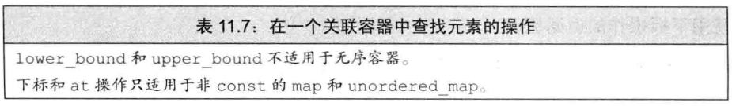


##### 对map使用find代替下标操作

判断在不在容器中，使用find()

##### 在multimap或multiset

同一key的不同value是连续的

在multimap使用find查找到的迭代器是第一个元素，使用count查找到的是value个数，然后往后移动迭代器这么多次就可以得到所有value

##### lower_bound 和 upper_bound

返回这个key的value的第一个值位置和尾后位置

如果key不存在那么二者相同

##### equal_range函数

输入一个key，返回pair，指向key的第一个位置和尾后位置

#### 11.3.6 一个单词转换的map

这一节是应用，跳过

### 11.4 无序容器

4个无序容器，不使用比较运算符组织元素，使用哈希函数和==运算符


##### 无序容器对关键字类型的要求

默认情况下无序容器使用key的==来比较

还使用hash<key_type>来生成哈希。

标准库提供了哈希模板：

+ 内置类型（包括指针）
+ 标准库类型（比如string）
+ 智能指针类型

自定义类型需要提供自定义的==(或相等比较函数)和hash函数

```c++
size_t hasher(const A &a){
    return hash<int>()(a.t);
}
bool equal(const A &a,const A &b){
    return a.t == b.t;
}
unordered_multiset<A,decltype(hasher)*,decltype(equal)*> temp(42,hasher,equal);//桶大小，哈希函数，相等函数
//如果A已经重载了==，可以不用相等函数
```

## 12 动态内存

为了更安全地使用动态对象，标准库定义了两个智能指针类型来管理动态分配的对象。

静态内存（使用栈空间）用于保存局部static对象，类static数据成员，抑菌剂定义在函数之外的变量。

栈内存用来保存函数内非static对象。

除了两种内存，每个程序还拥有一个内存池

叫**自由空间**或**堆**，用堆来存储动态分配的对象。

### 12.1 动态内存与智能指针

new，delete

三种类型都定义在memory头文件中

智能指针：

+ shared_ptr：
  + 允许多个指针指向同一个对象
+ unique_ptr：
  + 独占对象

还有一个weak_ptr的伴随类，是一种弱引用，指向shared_ptr所管理的对象

#### 12.1.1 shared_ptr类

智能指针也是模板


##### make_shared函数

```c++
auto a = make_shared<int>(1);
```

##### shared_ptr的拷贝和赋值

```c++
auto b(a);
c = a;
// 给c赋值，c指向了a指向的对象
// 递增a指向的对象的引用计数
// 递减c原来指向的对象的引用计数
// c原来指向的对象如果没有引用者，会自动释放
```

##### shared_prt自动销毁所管理的对象

自动调用析构函数

##### shared_prt还会自动释放相关联的内存

如果把shared_ptr存放在容器中，如果有部分元素用不到了，要记得erase

##### 使用了动态生存期的资源的类

如果两个对象共享底层的数据，可以使用动态指针

#### 12.1.2 直接管理内存

这个就比较低人一等了

非常容易出错

##### 使用new动态分配和初始化对象

```c++
int *pi = new int;
int *pi = new int(1023);
int *pi = new int{111};
```

##### 动态分配的const对象

可以使用new分配一个const对象

```c++
const int *p = new const int(1);
```

##### 内存耗尽

```c++
auto *p = new int;// 如果分配失败，抛出std:bad_alloc
auto *p = new (nothrow) int;// 分配失败返回空指针
```

这种形式的new为**定位new**

定位new表达式允许向new传递额外参数（比如nothrow）

##### 释放动态内存

delete p;

##### 指针值和delete

delete的指针必须指向动态分配的内存或者空指针。

释放不是new分配的内存或者将相同的指针值释放多次，行为是未定义的。

所以delete之后要**赋值nullptr**

通常编译器分辨不出指针指向的是静态还是动态分配的对象，也不能分辨指向的内存是否已经被释放。所以delete表达式大多数编译器会编译通过。

delete不是指针，编译器会报错。

const对象的值不能改变，但是可以delete

##### 动态对象的生存期直到被释放为止

##### delete之后重置指针

delete之后指针就变成**空悬指针**，所以需要赋值nullptr

但是没啥大用

##### 12.1.3 shared_ptr和new结合使用

不初始化智能指针就会被初始化成空指针。

可以使用new返回的指针初始化智能指针。

```c++
shared_ptr<int> p(new int(42));
//不可以直接=,只能直接初始化
//因为不能把内置指针隐式转换为智能指针
```


##### 不要混合使用普通指针和智能指针

shared_ptr可以协调对象的析构，但这仅限于其自身的拷贝（shared_ptr）之间，所以要使用make_shared而不是new，来保证分配对象的时候就已经绑定了一个shared_ptr，避免无意中把同一块内存绑定到多个独立创建的shared_ptr

传递普通参数会拷贝shared_ptr，导致引用+1,

用普通指针初始化shared_ptr当参数传进去，等到函数结束了普通指针就被释放掉了。

```c++
process(shared_ptr<int>(x));//x是普通指针
int j = *x;//x变成了空悬指针
```

使用一个内置指针来访问智能指针负责的对象很危险，无法直到对象何时被销毁

##### 也不要使用get初始化另一个智能指针或为智能指针赋值

智能指针.get()返回内置指针。类似string的.c_str()

用这个内置指针初始化临时变量会导致内置指针被销毁

##### 其他shared_ptr操作

.reset()把内置指针赋值给shared_ptr

#### 12.1.4 智能指针和异常

函数内部出错，定义的智能指针会释放，new的不会释放

##### 智能指针和哑类

为c和c++两种语言设计的类，通常都要求用户显示地释放所使用的资源，没有定义析构函数负责清理资源。

比如需要disconnect(conn);释放资源

##### 使用我们自己的释放操作

使用shared_ptr管理哑类，需要我们定义一个函数替代delete。这个**删除器**（deleter）需要完成对shared_ptr中的指针的释放。

```c++
void end_conn(conn *p){disconnect(*p);}
connection c = connect(&d);
shared_ptr<connection> p(&c, end_conn);
//用普通指针初始化shared_ptr，可以传递一个（可选的）指向删除器函数的参数
```

此时p销毁，不会对自己保存的指针调用delete，而是调用end_conn。

#### 12.1.5 unique_ptr


不能直接拷贝或赋值unique_ptr，可以通过调用release或reset把指针的所有权从不是const的unique_ptr转移到另一个unique_ptr

```c++
p2.reset(p1.release());//p2是unique_ptr
```

##### 传递unique_ptr参数和返回unique_ptr

可以拷贝或赋值一个即将被销毁的unique_ptr，最常见的例子是中函数返回一个unique_ptr

```c++
...{
    return unique_ptr<int>(new int(p));
    // 或者
    unique_ptr<int> ret(new int(p));
    return ret;
}
```

此时编译器执行一种特殊的拷贝

##### 向后兼容：auto_ptr

标准库的较早版本包含了一个名为auto_ptr的类，具有unique_ptr的部分特性。不能在容器中保存auto_ptr，也不能从函数返回auto_ptr

最好不要使用auto_ptr

##### 向unique_ptr传递删除器

和shared_ptr一样可以重载一个默认的删除器

但是二者管理删除器的方式不一样

重载一个unique_ptr中的删除器会影响到unique_ptr类型以及如何构造（或reset）该类型的对象。

```c++
unique_ptr<objT,delT> p(new objT, fcn);
//fcn是delT类型的指针。delT一般是函数指针
```

#### 12.1.6 weak_ptr

是不控制所指向对象生存期的智能指针。它指向一个由shared_ptr所管理的对象。把一个weak_ptr绑定到一个shared_ptr不会改变shared_ptr的引用计数。所以shared_ptr计数为0对象销毁了，weak_ptr就会指向未定义的对象（我猜）。


```c++
if(auto np = wp.lock()){
    // np不为空则进入
    // np是shared_ptr
    // 使用np访问共享对象是安全的
}
```

##### 核查指针类

weak_ptr可以阻止用户访问一个不再存在的对象（这个对象之前由shared_ptr指向）

类对象使用shared_ptr管理资源，申请资源的时候保存一个weak_ptr，通过weak_ptr.lock()检查是否还有资源

##### 指针操作

无内容

### 12.2 动态数组

vector和string需要一次性给很多元素分配内存，需要一次性分配一个数组

new、**allocator类**

#### 12.2.1 new和数组

```c++
int *p = new int[size];
```

##### 分配一个数组会得到一个元素类型的指针

所以返回的不是数组类型，不能使用begin和end

```c++
int *p = new int[10];//未初始化
int *p = new int[10]();//值初始化为0
int *p = new int[10](1);//错误！new数组不能有初始化参数
int *p = new int[10]{1,2,3,4,5};//前五个有值，后面都是0，默认初始化
```

列表初始化数目大于元素数目，不会分配任何内存，抛出bad_array_new_length异常（clion会报too many arguments）

##### 动态分配一个空数组是合法的

可以分配一个size=0的数组，但是不能解引用指针

##### 释放动态数组

delete [] a;

会逆序销毁，从最后一个到第一个。

##### 智能指针和动态数组

```c++
unique_ptr<int []> p(new int[10]);
p.release();//自动使用delete[]
```


shared_ptr不支持直接管理动态数组，如果非要管理需要提供自定义删除器

而且类型不能填数组，只能是普通对象。

```c++
shared_ptr<int> p(new int[10],[](int*p){delete[] p;});
p.reset();
p[1];//也不支持
*(p.get()+i);//转换成内置指针处理
```

也就是不提供删除器只会删除第一个元素，导致内存泄漏，但是指针是可以指向数组的。

#### 12.2.2 allocator类

new存在灵活性上的局限，比如它把内存分配和对象构造组合在一起

delete把对象析构和内存释放组合在一起

分配单个对象才希望内存分配组合对象初始化，因为此时直到对象应该有的值，但是分配数组无法已知全部对象的值，所以希望内存分配和对象构造分离。

没有默认构造函数的类不能动态分配数组（我猜这里指的是无参构造，因为new不能传参数）

##### allocator类

定义在memory中

帮助我们将内存分配和对象构造分离开来。

它提供一种类型感知的内存分配方法，分配的内存是原始的，未构造的。

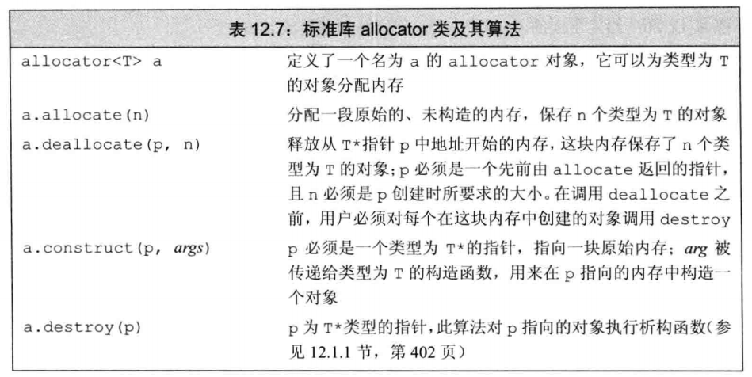

```c++
auto p = a.allocate(n);//分配内存，得到头指针
a.construct((p+i),args);//构造
a.destroy(p+i);//析构
a.deallocate(p,n);//释放内存
```


批量拷贝或创建元素的算法

### 12.3 使用标准库：应用文本查询程序

应用，略

## 13 拷贝控制

类的五中特殊成员函数

1. 拷贝构造函数
2. 拷贝赋值运算符
3. 移动构造函数
4. 移动赋值运算符
5. 析构函数

### 13.1 拷贝，赋值与销毁

#### 13.1.1 拷贝构造函数

拷贝构造函数：

+ 第一个参数是自身类类型的**引用**
  + 引用可以不是const
+ 任何额外参数都有默认值

```c++
class A{
    A(const A&);
}
```

不能是explicit，因为拷贝构造函数一般都被隐式地使用

##### 合成拷贝构造函数

即使定义了其他构造函数，也会合成拷贝构造函数

有些类的合成拷贝构造函数用于**阻止拷贝**

合成的拷贝构造函数会把所有**非static成员**拷贝到新对象中

类类型的成员调用拷贝构造函数，内置类型直接拷贝，数组类型会逐元素拷贝。

##### 拷贝初始化


直接初始化要求编译器使用普通的函数匹配来匹配构造函数，拷贝初始化把右侧对象拷贝到正在创建的对象中，如果有需要还要进行类型转换

如果一个类有移动构造函数，拷贝初始化有时会使用移动构造函数而不是拷贝构造函数

拷贝初始化发生场合：

1. 用=定义变量
2. 将对象作为实参传递给非引用的形参
3. 从一个返回类型为非引用类型的函数返回对象
4. 用列表初始化一个数组中的元素或一个聚合类中的成员

某些类类型还会对它们所分配的对象使用拷贝初始化，比如初始化标准库容器或是对用insert或push成员。使用emplace成员创建的元素都进行直接初始化。

##### 参数和返回值

拷贝构造函数用来初始化非引用类类型参数，所以拷贝构造函数自身的参数需要是引用，不然无法初始化自己的参数。

##### 拷贝初始化的限制

接受不是自身类型的构造函数最好声明为explicit，比如用size初始化vector的构造函数，需要显式地使用()调用

##### 编译器可以绕过拷贝构造函数

但不是必须绕过

```c++
string a = "1";
//改写成
string a("a");//略过拷贝构造
```

即使略过了，拷贝构造函数或移动构造函数也必须存在且可访问（不能是private)

#### 13.1.2 拷贝赋值运算符

两个对象都已定义

##### 重载赋值运算符

运算符的左侧运算对象绑定到隐式的this参数

为了和内置类型的赋值一致（也就是从右往左的连续赋值），赋值运算符通常返回一个指向其左侧对象的引用

```c++
class A{
public:
    A& operator=(const A&);//赋值运算符
}
```

标准库通常要求保存在容器中的类型要具有赋值运算符，且其返回值是左侧运算对象的引用

##### 合成拷贝赋值运算符

有些合成拷贝赋值运算符用于禁止赋值

把右侧非static成员赋值给左侧，数组也是逐个元素赋值

#### 13.1.3 析构函数

销毁对象的非static数据成员

析构函数体时作为成员销毁步骤之外的另一部分而进行，在执行完析构函数体之后会执行销毁成员。

无参数且不重载，所以一个类只有一个

```c++
class A{
    ~A();
}
```

##### 析构函数完成什么工作

销毁类类型的成员会执行成员自己的析构函数，销毁内置类型什么也不用做，内置类型没有析构函数

隐式销毁内置类型的指针成员不会delete所指向的对象，所以需要显示delete对象，但是智能指针是类类型，有析构函数，会自动销毁指向的对象

##### 什么时候会调用析构函数

对象被销毁就会调用

1. 离开自身作用域
2. 作为成员，然后所在对象被销毁时
3. 作为元素，容器被销毁时
4. 被动态分配，指向它的指针被delete时
5. 作为临时对象，当创建它的完整表达式结束时

##### 合成析构函数

有时也用来阻止销毁

#### 13.1.4 三/五法则

新标准：移动构造函数、移动赋值运算符

##### 需要析构函数的类也需要拷贝和赋值操作

比如存在动态分配内存

##### 拷贝和赋值同时被需要

#### 13.1.5 使用=default

显式要求编译器生成合成的版本

在类内使用=default会变成inline函数

只能对具有合成版本的成员使用=default（默认构造函数、拷贝控制函数，析构函数)

#### 13.1.6 阻止拷贝

iostream类阻止拷贝，避免多个对象写入或读取相同的io缓冲。

##### 定义删除的函数

c++11

```c++
class A{
    A(const A&) = delete;//阻止拷贝
    A& operator=(const A&) = delete;//阻止赋值
}
```

=delete 通知编译器我们不希望定义这些成员，所以编译器不会自动合成。

=delete必须出现在函数第一次声明的时候，但是=default在类内类外都行。因为=default直到编译器生成代码才需要，但是=delete需要编译器知道应该禁止这个函数的使用。

任何函数都能指定=delete，可以用于重载函数的避免匹配

##### 析构函数不能是删除的成员

析构函数=delete不会报错，但是会不允许定义该类型的变量或创建该类型的临时变量。类的某个成员删除了析构函数，所在类也不能定义

但是可以动态分配（new），并且不能释放（delete）指向该类型动态分配的指针

##### 合成的拷贝控制成员可能是删除的

把合成的成员函数定义为删除的情况：


**默认构造函数**

类有const成员，则该成员不能使用合成的拷贝赋值运算符，因为不能给const成员赋新值，要在自定义的构造函数前列表初始化或使用类内初始值

**合成的拷贝赋值运算符**

类有引用成员，虽然可以把新值赋值给引用成员，但是这样是改变引用指向的对象的值，而不是引用本身，所以这样的成员不能使用默认的拷贝赋值，因为引用指向的对象没变，只是对象改变了。

**本质上**来说，当不可能拷贝、赋值或销毁类的成员时，类的合成拷贝控制成员就被定义为删除的。

##### private拷贝控制

c++11新标准之前通过把拷贝构造函数和拷贝赋值运算符声明为private来阻止拷贝

但是这样友元函数和成员函数仍然可以拷贝对象，所以需要把这些拷贝控制成员为private然后不定义它们。

声明不定义成员函数合法，只有一种例外。

> 这个例外就是虚函数。

试图访问一个未定义的成员会导致一个链接时错误。

### 13.2 拷贝控制和资源管理

定义拷贝操作使得对象看上去像一个值或指针。

行为像指针的类会共享状态

#### 12.2.1 行为像值的类

赋值运算符对于左侧对象（定义运算符的自身）改变了自身指针的指向，有时需要释放原来的对象。

如果把一个对象赋值给自身，赋值运算符必须能正确工作 。

要先拷贝右侧对象再销毁左侧对象

#### 13.2.2 定义行为像指针的类

可以使用shared_ptr管理类的所有对象，也可以使用**引用计数**直接管理资源

使用赋值运算符左侧对象的计数+1，右侧对象的计数-1

### 13.3 交换操作

管理资源的类定义swap函数

把自定义的swap声明为友元函数

交换内置类型用std::swap，交换自定义类型使用自定义swqp

对于自定义类型使用std::swap不会编译错误，如果当前作用域有多种，会匹配类型特定的版本

##### 在赋值运算符中使用swap

定义swap的类通常使用swap来定义赋值运算符，这些运算符使用了**拷贝并交换**的技术。这种技术把左侧运算对象与右侧运算对象的一个副本进行交换。

```c++
A& A::operator=(A a){
    swap(*this, a);//与副本交换，副本是新构造的对象
    //交换结束后，原先的内容放进了临时对象中，会被自动销毁
    return *this;
}
```

这种方法同样先拷贝再删除，所以保证异常安全。唯一可能的异常是拷贝构造函数中的new表达式，会在改变左侧对象之前抛出

### 13.4 拷贝控制示例

分配资源的类需要拷贝控制，除了资源管理的需求外，要求一致性的类也需要拷贝控制。

比如需要在多个地方存储的一条记录，记录需要一个共有的set记录自己被保存的位置。

### 13.5 动态内存管理类

需要可变空间可以使用标准库，也可以自定义

### 13.6 对象移动

c++11新标准，最主要的特性是移动而非拷贝对象的能力

标准库容器，string和shared_ptr既支持移动也支持拷贝

IO类和unique_ptr类可以移动但不能拷贝

#### 13.6.1 右值引用

https://zhuanlan.zhihu.com/p/335994370

左值**可以取地址、位于等号左边**；而右值**没法取地址，位于等号右边**。有地址的变量就是左值，没有地址的字面值、临时值就是右值

c++11：为了支持移动操作引入的新引用类型

右值引用只能绑定到一个即将销毁的对象

左值表示对象的身份，右值表示对象的值

普通引用是左值引用，不能绑定到 要求转换的表达式、字面量、返回右值的表达式，但是右值引用可以。


##### 左值持久，右值短暂

右值引用只能绑定到临时对象

+ 所引用对象将要被销毁
+ 该对象没有其他用户

所以使用右值引用的代码可以自由接管所引用对象的资源（？

##### 变量是左值

变量可以看做只有一个运算对象而没有运算符的表达式。

变量表达式都是左值，所以不能把一个右值引用绑定到一个右值引用的变量上，因为右值引用的变量也是变量，是左值。

##### std::move()

```cpp
int a = 5; // a是个左值
int &&ref_a_right = std::move(a); // 通过std::move将左值转化为右值，可以被右值引用指向
```

**事实上std::move移动不了什么，唯一的功能是把左值强制转化为右值**，让右值引用可以指向左值。其实现等同于一个类型转换：`static_cast<T&&>(lvalue)`。 所以，**单纯的std::move(xxx)不会有性能提升**

右值引用能指向右值，本质上也是把右值提升为一个左值，并定义一个右值引用通过std::move指向该左值：

```cpp
int &&ref_a = 5;
ref_a = 6;

等同于以下代码：

int temp = 5;
int &&ref_a = std::move(temp);
ref_a = 6;
```

**作为函数返回值的 && 是右值，直接声明出来的 && 是左值**

1. **从性能上讲，左右值引用没有区别，传参使用左右值引用都可以避免拷贝。**
2. **右值引用可以直接指向右值，也可以通过std::move指向左值；而左值引用只能指向左值(const左值引用也能指向右值)。**
3. **作为函数形参时，右值引用更灵活。虽然const左值引用也可以做到左右值都接受，但它无法修改，有一定局限性。**

具体应用见链接

**因此，可移动对象在<需要拷贝且被拷贝者之后不再被需要>的场景，建议使用**`std::move`**触发移动语义，提升性能。**

标准库参数为左值就是copy，为右值就是移动，所以可以使用std::move使用移动版本，或者直接使用右值（字面量，函数返回值）

**完美转发 std::forward**

与move相比，forward更强大，move只能转出来右值，forward都可以。

>  std::forward<T>(u)有两个参数：T与 u。 a. 当T为左值引用类型时，u将被转换为T类型的左值； b. 否则u将被转换为T类型右值。

#### 13.6.2 移动构造函数和移动赋值运算符

```c++
A::A(A &&a) noexcept //移动操作不应抛出异常
: t1(a.t1), t2(a.t2) //成员初始化器接管a的资源
{
    a.t1 = a.t2 = nullptr; //原来的对象经过移动操作一定要保证析构安全，不会释放掉已经移动了的资源
}
```

拷贝构造函数分配新内存，移动构造函数不分配新内存

##### 移动操作、标准库容器和异常

移动操作只移动资源，不分配，所以不会抛出异常

显式告诉编译器保证不出错：

c++11 noexcept关键字

移动构造函数和移动赋值运算符都需要

##### 移动赋值运算符

```c++
A &A::operator=(A &&a) noexcept
{
    //检测自赋值
    if(this != &a){
        free();//自己的用于释放资源的函数
        t1 = a.t1;
    	//...
        a.t1 = /*...*/ = nullptr;//把a置于可析构状态
    }
}
```

##### 移后源对象必须可析构

单纯的移动操作不会销毁对象，但是移动后的对象一定是

1. 可销毁的
2. 有效的（可赋新值）

##### 合成的移动操作

只有当一个类没有定义任何自己版本的拷贝控制成员，且它的所有数据成员都能移动构造或移动赋值，编译器才会为它合成移动构造函数和移动赋值运算符（内置类型或定义了移动操作的类对象）

移动操作永远不会隐式定义为删除的函数

如果显式地要求编译器生成=default移动操作，且编译器不能移动所有成员，则编译器会把移动操作定义为删除的函数


定义了移动操作的类也必须定义自己的拷贝操作，不然拷贝成员会被定义为删除

##### 移动右值，拷贝左值

函数匹配：拷贝构造函数与移动构造函数

如果一个类有一个可用的拷贝构造函数且没有移动构造函数，则对象会通过拷贝构造函数来移动，且原对象不变

##### 拷贝并交换赋值运算符和移动操作

如果一个类有两种构造函数

```c++
A& operator=(A a);
```

参数为对象复制的赋值运算符

如果传入左值，局部对象会使用拷贝构造，等号功能为拷贝赋值

如果传入右值，局部对象使用移动构造，等号功能为移动赋值

##### 更新三/五法则

两个拷贝、两个移动、一个析构

如果一个类定义了任何一个拷贝操作，就应该定义全部5个操作

为了移动资源或者为了效率需要定义两个移动操作

##### 移动迭代器

c++11新标准

这种迭代器解引用返回右值引用

```c++
make_move_iterator(begin());//接受一个普通迭代器，返回移动迭代器

uninitialized_copy(it1,it2,first);//这个算法可以使用移动迭代器
```

如果first指向的对象有移动构造函数，那么使用移动迭代器会执行移动

#### 13.6.3 右值引用和成员函数

成员函数支持移动和拷贝两个重载，移动版本接受参数T&&，拷贝版本接受参数const T&

##### 右值和左值引用成员函数

```c++
string s1 = "aaa",s2 = "bbb";
auto n = (s1+s2).find('a');//在右值上调用成员函数
s1 + s2 = "sadf";//给右值赋值，显然这不合理
```

新旧标准都支持向右值赋值，但是新标准可以阻止这么用

**引用限定符**

和const限定符一样，只能用于（非static）成员函数

&表示this可以指向左值

&&表示this可以指向右值

```c++
class A{
public:
    A &A=(const A&) &;//只能左值用
    int test() &&;//直接右值用
    int test2() const &;//const和引用限定符同时用，const在前
}
```

##### 重载和引用函数


## 14 重载运算与类型转换

### 14.1 基本概念

除了重载的函数调用运算符（）之外，其他重载运算符不能含有默认实参。

如果一个运算符是成员函数，那么第一个运算对象就是隐式的this指针（原本应该是左侧对象）所以参数数量会比运算对象的数量少一个。

不能重载内置类型运算对象的运算符

不能发明新的运算符，比如operator**来执行幂操作

重载后的运算符优先级和结合律与内置运算符一致


##### 直接调用

```c++
//两种等价的调用方式
d1 + d2;
operator+(d1,d2);//非成员函数
d1.operator+(d2);//成员函数
```

##### 某些运算符不应该被重载

& | ，运算对象求值顺序规则无法保留

&& || 短路求值属性无法保留

重载版本有缺陷，不符合经验

逗号运算符和取地址运算符已经规定了作用域类类型对象的含义，所以也不应该被重载

##### 使用与内置类型一致的含义

先确定类提供的操作，再考虑设计为普通函数还是重载运算符


避免改变运算符的含义，避免产生二义性

##### 赋值和复合赋值运算符

有+，最好也提供+=

##### 选择作为成员或者非成员


如果想实现含有类对象的混合类型表达式，最好设计成非成员函数


定义为非成员函数加上类对象的构造函数，左侧不是对应类的对象也能**转换成目标对象**，从而加入运算

### 14.2 输入和输出运算符

#### 14.2.1 重载输出运算符<<

第一个形参是ostream对象的引用，不能是const，因为向流写入内容会改变其状态，是引用是因为不能直接复制ostream对象。

第二个形参是常量引用，避免复制

返回值是ostream形参

##### 输出运算符尽量减少格式化操作

比如换行符，把权力交给用户

##### 输入输出运算符必须是非成员函数

```c++
Data data;
data << cout;//成员函数，左侧是输出对象，不合理
cout << data;//非成员函数，合理
```

就算应该是成员函数，也要是ostream或者istream的成员，但是这两个是标准库里面的类，改不了

#### 14.2.2 重载输入运算符>>

第二个形参是非常量引用

需要处理输入失败的情况


##### 输入时的错误

+ 读取到错误类型
+ 文件末尾或其他流错误

不进行逐个检查，一次性读完了再检查流的状态

需要负责从错误中恢复流状态

##### 标示错误

需要设置流的条件状态来表示失败信息

通常输入运算符设置failbit

eofbit表示文件耗尽，badbit表示流被破坏

最好让IO标准库自己来表示这些错误

### 14.3 算数和关系运算符

通常把算数和关系运算符定义成非成员函数来允许对左侧或右侧对象进行转换

一般不需要改变运算对象的状态，所以形参都是常量引用。

使用类已经定义的复合赋值来定义算术运算符


#### 14.3.1 相等运算符

相等运算符应该具有传递性

同时定义==和!=，且复用

#### 14.3.2 关系运算符

有需求再定义

### 14.4 赋值运算符

必须是成员函数

也应该支持列表初始化，复用普通的赋值运算符

```c++
class A{
public:
A &operator=(std::initializer_list<std::string>);
}
```

先销毁当前内存空间，再创建新空间。

##### 复合赋值运算符

不一定但最好是类成员，和别的赋值运算符一致

### 14.5 下标运算符

```c++
std::string &operator[](std::size_t n){return a[n];}
```

必须是成员函数

可以提供返回普通引用和常量引用两个版本

### 14.6 递增和递减运算符

因为正好改变了操作对象的状态，所以最好是成员函数

可以定义前置和后置版本

##### 前置版本


返回操作之后的对象的引用

##### 区分前置和后置

普通的重载形式无法区分


由于用不到，所以也不需要给形参命名

##### 显式地调用后置运算符


### 14.7 成员访问运算符

解引用(*)和箭头运算符(->)

箭头运算符必须是类成员，解引用最好是类成员

##### 对箭头运算符返回值的限定

point->mem的执行过程


重载的箭头运算符必须返回类的指针或者自定义了箭头运算符的某个类的对象（啥意思，看不懂）

### 14.8 函数调用运算符

必须是成员函数

像使用函数一样使用对象，这样的类能存储状态，所以比一般的函数更灵活

##### 含有状态的函数对象类

#### 14.8.1 lambda是函数对象

lambd生成的类含有一个重载的函数调用运算符

默认lambda的函数调用运算符是const，如果lambda被声明为可变的（mutable），调用运算符就不是const

##### 表示lambda及相应捕获的类

捕获变量时，由程序确保lambda执行时所引用的对象确实存在，所以可以直接使用引用，不需要在lambda产生的类中存储

值拷贝需要捕获到lambda，建立数据成员并且创建构造函数

#### 14.8.2 标准库定义的函数对象


#include <functional\>


##### 在算法中使用标准库函数对象

把函数对象传入算法

```c++
vector<string *> a;
//错误，不能直接比较指针，行为未定义
sort(a.begin(),a.end(),[](string *b, string *c){ return a<b;});
//正确的，使用标准库函数对象来实现
sort(a.begin(),a.end(),less<string*>());
```

#### 14.8.3 可调用对象与function

不同函数对象可以有相同调用形式

##### 不同类型可能具有相同的调用形式

比如都是int(int,int)，所以可以存储在一个格式的数据结构中

**函数表**存储函数指针，使用map实现，用string对象做索引


```c++
map<string, int(*)(int int)> b;
b.insert({"+",add});// {"+",add}是一个pair
b.insert({"s",mod});// mod不是一个函数指针，有自己的类类型
//函数对象类使用function类类型

```

##### 标准库function类类型


```c++
map<string, function<int(int,int)>> b;
//然后可以存储函数指针、函数对象、lambda都可以了
b["+"](10,5);//调用add(10,5)
```

##### 重载的函数与function

不能（直接）把重载函数的名字存入function类型的对象，因为存在重载函数

```c++
//使用函数指针
int (*fp)(int,int) = add;
b.insert({"+",fp});
//使用lambda,让编译器做函数匹配
b.insert({"+",[](int a,int b){return add(a,b);}})
```

### 14.9 重载、类型转换与运算符

通过类型转换运算符自动转换类型

#### 14.9.1 类型转换运算符

将一个类类型转换为其他类型，必须是成员函数，不能有返回类型，形参列表必须为空，通常是const

```c++
operator type() const;
```

##### 定义含有类型转换运算符的类


```c++
SmallInt si;
si = 4;//4转换成SmallInt，再调用operator=
si + 3;//si转换成int，再执行整数加法
si = 3.14;//先进行double到int，再到smallint
```

##### 类型转换符可能产生意外结果

比如类定义了向bool的类型转换，因为bool是算数类型所以可以用在任何需要算数类型的上下文

```c++
int i = 42;
cin << i;
```

本来是把输出运算符用在cin上，这是错误的，但是如果cin能转换成bool，就变成了bool类型左移42位，通过了编译。

##### 显式地类型转换运算符

explicit

```c++
class SmallInt {
public:
    //编译器不会自动执行这一类型转换
    explicit operator int() const { return val; }
}
SmallInt si = 3;
static_cast<int>(si) + 3;//显式地请求类型转换
```

例外：

1. if、while、do语句条件部分
2. for语句头的条件表达式
3. 逻辑非(!)或(||)与(&&)的运算对象
4. 条件运算符(?:)的条件表达式

##### 转换为bool

早期标准库IO类型定义了向void*的转换规则，避免转换到bool发生上面的bug

c++11新标准，IO标准库通过定义一个向bool的显示类型转换

while( std::cin >> value)

cin被istream opeartor bool类型转换函数隐式进行了转换，如果cin是good就是true，否则是false

> 向bool的转换通常用在条件部分，所以operator bool一般被定义为explicit

#### 14.9.2 避免有二义性的类型转换

通常情况下，不要为类定义相同的类型转换，也不要在类中定义两个及以上转换源或转换目标是算数类型的转换

##### 实参匹配和相同的类型转换

不要在两个类之间构建相同的类型转换

比如A可以由B构造，B可以通过隐式类型转换到A

就存在两种用B获得A的方式


只能显式调用

强制类型转换也具有二义性，所以也不能用

##### 二义性与转换目标为内置类型的多重类型转换


int、double到long double转换级别一致，所以会有二义性


存在最佳匹配，没有二义性

经验规则：


##### 重载函数与转换构造函数

使用重载函数时，如果用户给定的参数可以转换成不同类型，这些类型都是这个函数的可选参数，就会产生二义性

```c++
void f(A);
void f(B);
//int可以转换到A或B
f(1);//二义性
f(A(1));//显式构造调用
```

如果需要显式构造调用，那么说明程序有缺陷

##### 重载函数与用户定义的类型转换

同上，这时候是通过自动类型转换(int->double)，再走构造函数产生的匹配

太复杂了看不懂


#### 14.9.3 函数匹配与重载运算符

```c++
a sym b;
//可能是
a.operatorsym(b);
operatorsym(a,b);
```

无法通过调用的形式来区分当前调用的是成员函数还是非成员函数

候选函数：

+ 运算符非成员版本
+ 运算符成员版本（如果左侧是类类型）
+ 运算符内置版本

太复杂了，太痛苦了

## 15 面向对象程序设计

### 15.1 oop概述

基类希望派生类各自定义自己版本的函数，声明为**虚函数**

派生类通过类派生列表指名父类，父类前面可以有访问说明符

```c++
class father{
public:
	virtual int A();
}
class son: public father{
 	int A() override;
}
```

##### 动态绑定

使用基类的引用或指针调用一个虚函数会发生动态绑定

向接受父类的函数传入一个父类或子类，函数中会调用对应对象自己的方法

### 15.2 定义基类和派生类

#### 15.2.1 定义基类

继承关系中根节点的类（祖宗类）应该有一个虚析构函数，即使什么也不做

##### 成员函数和继承

+ 基类希望派生类覆盖的函数（虚函数）
+ 基类希望派生类直接继承不改变的函数

virtual关键字，实现动态绑定（运行时确定调用的函数）

任何构造函数之外的非静态函数都可以是虚函数

virtual只能在类内声明出现

父类是virtual，子类隐式地也是

如果成员函数没有被声明成虚函数，解析过程就会发生在编译时，不是动态

#### 15.2.2 定义派生类

类派生列表

##### 派生类中的虚函数

如果派生类没有覆盖基类虚函数，那么会直接继承基类的版本

c++11 override，显式注明覆盖了虚函数

##### 派生类到基类的类型转换

##### 派生类构造函数

首先初始化基类的部分，然后按照声明的次序初始化派生类的成员

初始化基类最好是用基类的构造函数，不能直接给基类成员赋值

##### 继承与静态成员

静态成员在整个继承体系中唯一

##### 派生类的声明

不需要出现派生列表，直接声明就行

##### 被用作基类的类

必须出现定义，因为此时派生类需要知道基类的成员

所以不能自己派生自己

```c++
class A;
class B : A{}; //错误
```

##### 防止继承

c++11 final

```c++
class A final{};
```

#### 15.2.3 类型转换与继承

基类引用或指针可以指向派生类，使用时并不清楚这个指针指向的是基类还是派生类，但是可以当基类使用

智能指针也支持

##### 静态类型与动态类型

基类的指针或引用的静态类型可能与动态类型不一致，原因就是上面

##### 不存在从基类向派生类的隐式类型转换

转换只对引用或指针有效

存在派生类到基类的类型转换是因为派生类对象都包含一个基类部分，基类的引用或指针可以绑定到这个基类部分。

一个基类的对象既可以独立存在，也可以作为派生类对象的一部分存在。

但是基类对象不一定是派生类的一部分，所以不能从基类自动转换到派生类。

##### 在对象之间不存在类型转换

用一个派生类对象为一个基类对象赋值或初始化时，只有派生类对象的基类部分会被拷贝、移动或赋值，派生类部分回被忽略掉

取决于基类对象的拷贝构造函数定义，因为只能接受自己类型的对象，所以派生类会被转成基类

（如果不是public继承，那么派生类对象不是会获得不完整的基类对象吗）

### 15.3 虚函数

必须为每一个虚函数都提供定义，因为虚函数会被动态绑定，编译器也不知道到底会用到哪一个虚函数

##### 对虚函数的调用可能运行时才被解析

动态绑定只有通过指针或引用调用虚函数才会发生

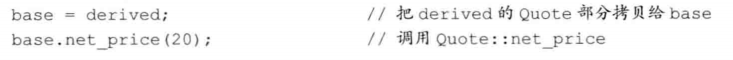

> c++多态性
>
> 根本在于引用或指针的静态类型与动态类型不同

##### 派生类中的虚函数

派生类中覆盖虚函数可以再使用virtual，但是没必要，一旦某个函数是虚函数，所有派生类中都是虚函数

##### final和override

c++11

让编译器为我们发现错误

##### 虚函数与默认实参

基类和派生类都能定义，根据调用时的动态类型选择哪一组默认实参（最好都相同）

#####　回避虚函数机制

不要动态绑定，直接执行某个版本

使用作用域运算符

```c++
baseP->Quote::print();//不动态绑定
baseP->print();//动态绑定
```

通常只有友元函数（或成员函数）使用作用域运算符

当需要调用自己已经覆盖的父类虚函数时需要使用

不然就是自己调用自己，无限递归

### 15.4 抽象基类

##### 纯虚函数

在声明语句分号前加 =0

只能用在类内虚函数声明语句处

```c++
class A{
    virtual int print() = 0;
}
```

可以提供纯虚函数的定义，但是只能在类外

##### 含有纯虚函数的类是抽象基类

含有，或不覆盖直接继承纯虚函数的类是抽象基类

抽象基类只负责定义接口，不能定义它的对象

概念**重构**（不懂）


### 15.5 访问控制和继承

##### 受保护的成员

protected：派生类和自己的友元看得见，外部看不见

派生类的友元看不见，需要通过派生类对象间接访问父类的protected成员


所以派生类中接受父类对象的友元看不见父类的protected成员，本质上是直接访问了父类的protected成员

##### 公有、私有和受保护继承

继承用的访问说明符直接降低权限

##### 派生类向基类转换的可访问性

对于代码中的某个节点，如果基类的公有成员可访问，那么派生类向基类的类型转换也是可访问的

成员函数和友元函数中，public、protected、private都可以？

> 派生类向基类的类型转换中，成员函数只有public和protected可以访问，友元函数无视public、protected、private都可以访问。

##### 友元与继承

友元不能继承，每个类各自负责自己的访问权限

##### 改变个别成员的可访问性

```c++
class base{
public:
    int size() {}
protected:
    int n;
}
class derived: private base{
public:
	using base::size;
protected:
    using base::n;
}
```

using 重置访问权限，新的权限就是using所在区域的权限

只能为自己能访问到的名字提供using声明，比如父类private的名字就不能说明

##### 默认的继承保护级别

stuct默认public继承，class默认private继承

struct默认public访问说明符，class默认private

除此之外没区别了

### 15.6 继承中的类作用域

派生类作用域实际上在基类之内，查找名字从派生类到基类到外部，所以派生类才能使用基类名字

##### 在编译时进行名字查找


### 15.7 构造函数与拷贝控制

### 15.8 容器与继承

### 15.9 文本查询程序再探

## 16 模板与泛型编程

## 17 标准库特殊设施

## 18 用于大型程序的工具

## 19 特殊工具与技术
