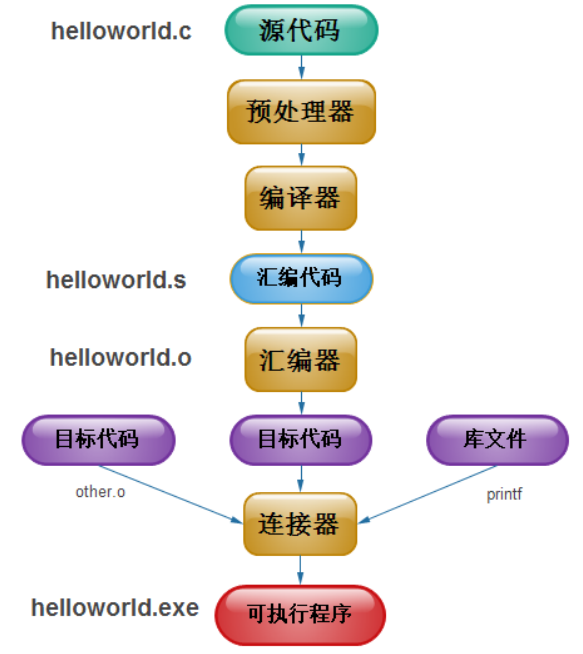

# makefile



编译流程

## 规则

```makefile
TARGET...: DEPENDENCIES...
    COMMAND
    ...
```

- TARGER：目标程序产生的文件，如可执行文件和目标文件，目标也可以是要执行的动作，如clean，也称为伪目标。
- DEPENDENCIES:依赖是用来产生目标的输入文件列表，一个目标通常依赖与多个文件。
- COMMAND:命令是make执行的动作（命令是shell命令或是可在shell下执行的程序），注意每个命令行的起始字符必须为TAB字符。
- 如果DEPENDENCIES中有一个或多个文件更新的话，COMMAND就要执行，这就是Makefile最核心的内容。

## 3. Makefile的简单示例

```shell
$ touch add.c add.h sub.c sub.h main.c
```

现在有这5个文件add.h 、sub.h中包含了函数声明，add.c、sub.c中包含了函数实现，main.c调用了函数。Makefile的文件：

```makefile
main:main.o add.o sub.o        #【目标文件是main，它依赖于main.o,add.o,sub.o这三个文件】
        gcc -Wall -g main.o add.o sub.o -o main    【由依赖文件生成目标文件应该执行的命令】
main.o:main.c
        gcc -Wall -g -c main.c -o main.o
add.o:add.c add.h
        gcc -Wall -g -c add.c -o add.o
sub.o:sub.c sub.h
        gcc -Wall -g -c sub.c -o sub.o
```

保存Makefile文件后执行make命令：

```shell
$ make
gcc -Wall -g -c main.c -o main.o
gcc -Wall -g -c add.c -o add.o
gcc -Wall -g -c sub.c -o sub.o
gcc -Wall -g main.o add.o sub.o -o main
```

可以看到执行了make之后，由于 目标文件main依赖于 main.o add.o sub.o ，所以是需要先 生成 这三个.o文件，最后才生成main。
 如果此时再次输入make，会看到：

```shell
$ make
make: 'main' is up to date.
```

make的编译规则是根据**时间**来进行判断，一旦依赖列表中某个文件的更新时间比目标文件晚，则会重新生成目标，否则会出现以上提示。
 **默认情况下敲击make将生成第一个目标**，也就是main。也可以生成指定的目标：

```shell
$ make add.o   【指定只生成add.o文件】
```

Makefile文件的名字不一定得命名为“Makefile”或"makefile"，使用其他名字也是可以的。例如我们由一个文件叫myMakefile，同样可以使用它：

```makefile
make -f myMakefile   【-f 选项的作用是把名字"myMakefile"作为makefile来对待。】
```

## 4.伪目标

==我觉得更像是指令目标==

```makefile
TARGET...: DEPENDENCIES...
    COMMAND    【注意COMMAND之前是一个TAB，不是空格】
    ...
```

前面说过，TARGET除了可以是目标文件之外，还可以是伪目标。执行伪目标的效果等于执行了某一个动作， 并不产生目标文件。例如添加一个伪目标：

```makefile
main:main.o add.o sub.o     
        gcc -Wall -g main.o add.o sub.o -o main  
main.o:main.c
        gcc -Wall -g -c main.c -o main.o
add.o:add.c add.h
        gcc -Wall -g -c add.c -o add.o
sub.o:sub.c sub.h
        gcc -Wall -g -c sub.c -o sub.o
clean :                             【这是一个伪目标】
        rm -f $(OBJECTS) main    
```

使用make来执行伪目标：

```shell
$ make clean
rm -f main.o add.o sub.o main  
```

可以看到make将执行伪目标下面的命令。

## 5. Makefile 自动化变量

从上面的Makefile文件我们发现一些问题：有时候目标文件的依赖列表过长，或者命令重复书写。利用Makefile自动化变量可以解决这个问题。

| 选项名 | 作用                   |
| ------ | ---------------------- |
| $@     | 规则的目标文件名       |
| $<     | 规则的第一个依赖文件名 |
| $^     | 规则的所有依赖文件列表 |

刚才的Makefile文件，我们可以改写为：

```makefile
main:main.o add.o sub.o
        gcc -Wall -g $^ -o $@      【等价于 gcc -Wall -g main.o add.o sub.o -o main】
main.o:main.c
        gcc -Wall -g -c $< -o $@
add.o:add.c add.h
        gcc -Wall -g -c $< -o $@
sub.o:sub.c sub.h
        gcc -Wall -g -c $< -o $@
```

执行make，可以看到效果和之前是一样的：

```shell
$ make
gcc -Wall -g -c main.c -o main.o
gcc -Wall -g -c add.c -o add.o
gcc -Wall -g -c sub.c -o sub.o
gcc -Wall -g main.o add.o sub.o -o main
```

还可以**自定义变量**：

```makefile
OBJECTS = main.o add .o sub.o 【OBJECTS是自定义的变量名】
main:$(OBJECTS)                        【可以在需要的地方使用变量名进行替换，替换规则为$(变量名)】
        gcc -Wall -g $^ -o $@
main.o:main.c
        gcc -Wall -g -c $< -o $@
add.o:add.c add.h
        gcc -Wall -g -c $< -o $@
sub.o:sub.c sub.h
        gcc -Wall -g -c $< -o $@
```

## 6. 编译生成多个可执行文件

假设现在不只是想生成可执行main，还想生成可执行文件main2，可以这样写

```makefile
BIN = main main2                【自定义变量BIN】
OBJECTS= main.o add.o sub.o  
all : $(BIN)   【关注重点】
main : $(OBJECTS)
        gcc -Wall -g  $< -o $@
main2: $(OBJECTS)
        gcc -Wall -g  $< -o $@
main.o : main.c
        gcc -Wall -g -c $< -o $@
main2.o :msin2.c
        gcc -Wall -g -c $< -o $@
add.o:add.c add.h
        gcc -Wall -g -c $< -o $@
sub.o:sub.c sub.h
        gcc -Wall -g -c $< -o $@
clean :
        rm -f $(OBJECTS) $(BIN)
```

为了生成目标文件all，需要先生成BIN，也即是 main main2。这样就可以生成两个可执行文件了。利用自定义变量可以再简化这段Makefile文件：

```makefile
BIN = main main2
OBJECTS= main.o add.o sub.o
CC = gcc
CFALGS = -Wall -g
all : $(BIN)
main : $(OBJECTS)
        $(CC) $(CFALGS)  $< -o $@
main2: $(OBJECTS)
        $(CC) $(CFALGS)  $< -o $@       
main.o : main.c
        $(CC) $(CFALGS) -c  $< -o $@
main2.o :msin2.c
        $(CC) $(CFALGS) -c  $< -o $@
add.o:add.c add.h
        $(CC) $(CFALGS) -c  $< -o $@
sub.o:sub.c sub.h
        $(CC) $(CFALGS) -c  $< -o $@
clean :
        rm -f $(OBJECTS) $(BIN)
```

但是这样看起来，重复的内容还是比较多，可以使用下面的方法来继续简化：

```makefile
BIN = main main2
OBJECTS= main.o add.o sub.o
CC = gcc
CFALGS = -Wall -g
all : $(BIN)
main : $(OBJECTS)
        $(CC) $(CFALGS)  $< -o $@
main2: $(OBJECTS)
        $(CC) $(CFALGS)  $< -o $@       
.o .c :                                               【关注重点在这里】
        $(CC) $(CFALGS) -c  $< -o $@
clean :
        rm -f $(OBJECTS) $(BIN)
```

利用 .o.c :，可以自动地把所有的.c文件到.o文件的生成都使用同一条命令来完成，简化的重复的工作。

## 7. make常用的内嵌函数

首先看make中函数调用的形式：

```makefile
//函数调用
$(function arguments)     【function是函数名称，arguments是参数，使用$来调用】
```

值得注意的是，函数名称与参数之间是空格。

来看三个常用make内嵌函数。

- $(wildcard PATTERN)    作用是在当前目录下匹配模式的文件。

```makefile
src = $(wildcard *.c)  【在当前目录下搜索所有.c文件，文件名称列表保存到src中】
```

- $(patsubst PATTENR,REPLACEMENT,TEXT) 模式替换函数，作用是把TEXT中文件列表从模式PATTENR替换为REPLACEMENT模式。

```makefile
$(patsubst %.c,%.o,$src)  【把src中的.c文件列表中的文件从.c替换为.o】
等价于：
$(src:.c =.o)   【这种方式更常用】
```

- shell函数

shell函数可以执行shell下的命令，同样是使用$来引用，例如

```makefile
$(shell ls -d */) 【将当前目录下的所有文件夹都列出来】
```

下面通过一个多级目录的例子来使用这些函数。场景是这样的，当前目录下有main.c文件，同时还有若干个目录，每个目录中都有各自的.c文件。利用所有的.c文件编译生成最后的main文件：

```makefile
CC       = gcc
CFLAGS   = -Wall -g
BIN      = main
SUBDIR   = $(shell ls -d */)      【SUBDIR变量保存了子目录的列表】
ROOTSRC  = $(wildcard *.c)  【ROOTSRC保存了当前目录下的.c文件列表】
ROOTOBJ  = $(ROOTSRC:%.c = %.o)  【ROOTBOJ 保存了当前目录下.c文件同名的.o列表】
SUBSRC   = $(shell find $(SUBDIR) -name '*.c')  【SUBSRC 保存了所有子目录下的的.c文件】
SUBOBJ   = $(SUBSRC:%.c = %.o)         【SUBOBJ保存了所有子目录下的.c文件同名的.o文件列表】
$(BIN):$(ROOTOBJ) $(SUBOBJ)         【main的生成依赖与当前目录及所有子目录下的.o文件】
        $(CC) $(CFLAGS) -o $(BIN) $(ROOTOBJ) $(SUBOBJ)
.o .c:
        $(CC) $(CFLAGS) -c $< -o $@    
clean:
        rm -f $(BIN) $(ROOTOBJ) $(SUBOBJ)
```

# cmake


# gcc 命令的常用选项 

| 选项         | 解释                                                         |
| ------------ | ------------------------------------------------------------ |
| -ansi        | 只支持 ANSI 标准的 C 语法。这一选项将禁止 GNU C 的某些特色， 例如 asm 或 typeof 关键词。 |
| -c           | 只编译并生成目标文件。                                       |
| -DMACRO      | 以字符串"1"定义 MACRO 宏。                                   |
| -DMACRO=DEFN | 以字符串"DEFN"定义 MACRO 宏。                                |
| -E           | 只运行 C 预编译器。                                          |
| -g           | 生成调试信息。GNU 调试器可利用该信息。                       |
| -IDIRECTORY  | 指定额外的头文件搜索路径DIRECTORY。                          |
| -LDIRECTORY  | 指定额外的函数库搜索路径DIRECTORY。                          |
| -lLIBRARY    | 连接时搜索指定的函数库LIBRARY。                              |
| -m486        | 针对 486 进行代码优化。                                      |
| -o FILE      | 生成指定的输出文件。用在生成可执行文件时。                   |
| -O0          | 不进行优化处理。                                             |
| -O 或 -O1    | 优化生成代码。                                               |
| -O2          | 进一步优化。                                                 |
| -O3          | 比 -O2 更进一步优化，包括 inline 函数。                      |
| -shared      | 生成共享目标文件。通常用在建立共享库时。                     |
| -static      | 禁止使用共享连接。                                           |
| -UMACRO      | 取消对 MACRO 宏的定义。                                      |
| -w           | 不生成任何警告信息。                                         |
| -Wall        | 生成所有警告信息。                                           |

​	
