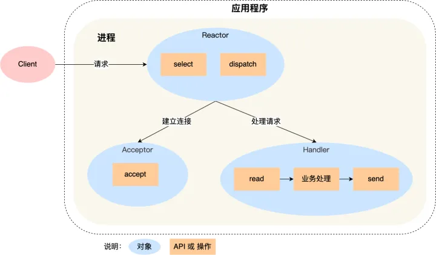
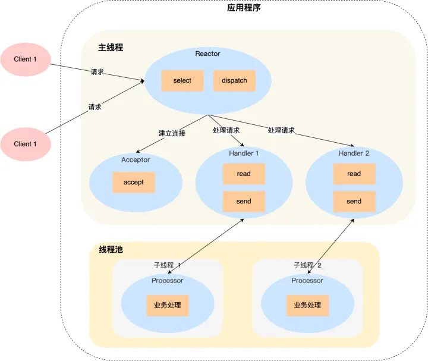
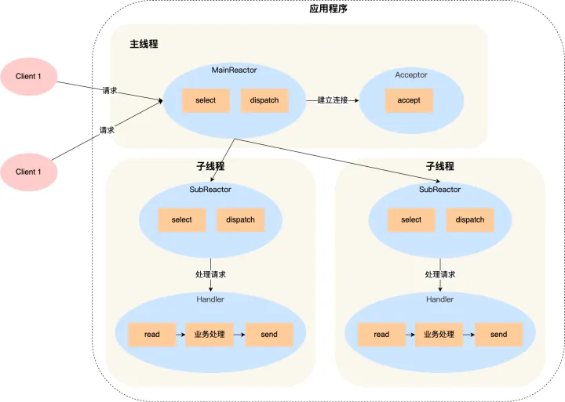
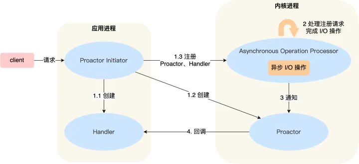

# Reactor和Proactor模式

[如何深刻理解Reactor和Proactor?](https://www.zhihu.com/question/26943938/answer/1856426252)

## 演进

**线程复用：线程池**

一个线程对应一个连接，线程会阻塞在read上，就没有办法处理其他连接

> 改成非阻塞socket，然后线程轮询地调用read
>
> 会消耗cpu，效率低

**io多路复用**（select/poll/epoll）

在获取事件时，先把我们要关心的连接传给内核，再由内核检测：

- 如果没有事件发生，线程只需**阻塞在这个系统调用**，而无需像前面的线程池方案那样轮训调用 read 操作来判断是否有数据。
- 如果有事件发生，内核会返回产生了事件的连接，线程就会从阻塞状态返回，然后在用户态中再处理这些连接对应的业务即可。

但是面向过程的方式，开发效率低

**Reactor 模式**

反应指的是「**对事件反应**」，也就是**来了一个事件，Reactor 就有相对应的反应/响应**。

事实上，Reactor 模式也叫 `Dispatcher` 模式，我觉得这个名字更贴合该模式的含义，即 **I/O 多路复用监听事件，收到事件后，根据事件类型分配（Dispatch）给某个进程 / 线程**。

Reactor 模式主要由 Reactor 和处理资源池这两个核心部分组成，它俩负责的事情如下：

- Reactor 负责监听和分发事件，事件类型包含连接事件、读写事件；
- 处理资源池负责处理事件，如 read -> 业务逻辑 -> send；

Reactor 模式是灵活多变的，可以应对不同的业务场景，灵活在于：

- Reactor 的数量可以只有一个，也可以有多个；
- 处理资源池可以是单个进程 / 线程，也可以是多个进程 /线程；

将上面的两个因素排列组设一下，理论上就可以有 4 种方案选择：

- 单 Reactor 单进程 / 线程；
- 单 Reactor 多进程 / 线程；
- 多 Reactor 单进程 / 线程；
- 多 Reactor 多进程 / 线程；

其中，「多 Reactor 单进程 / 线程」实现方案相比「单 Reactor 单进程 / 线程」方案，不仅复杂而且也没有性能优势，因此实际中并没有应用。

剩下的 3 个方案都是比较经典的，且都有应用在实际的项目中：

- 单 Reactor 单进程 / 线程；
- 单 Reactor 多线程 / 进程；
- 多 Reactor 多进程 / 线程；

方案具体使用进程还是线程，要看使用的编程语言以及平台有关：

- Java 语言一般使用线程，比如 Netty;
- C 语言使用进程和线程都可以，例如 Nginx 使用的是进程，Memcache 使用的是线程。

接下来，分别介绍这三个经典的 Reactor 方案。

## 三个reactor方案

### 单 Reactor 单进程 / 线程

一般来说，C 语言实现的是「**单 Reactor** ***单进程\***」的方案，因为 C 语编写完的程序，运行后就是一个独立的进程，不需要在进程中再创建线程。

而 Java 语言实现的是「**单 Reactor** ***单线程\***」的方案，因为 Java 程序是跑在 Java 虚拟机这个进程上面的，虚拟机中有很多线程，我们写的 Java 程序只是其中的一个线程而已。

我们来看看「**单 Reactor 单进程**」的方案示意图：

可以看到进程里有 **Reactor、Acceptor、Handler** 这三个对象：

- Reactor 对象的作用是监听和分发事件；
- Acceptor 对象的作用是获取连接；
- Handler 对象的作用是处理业务；

对象里的 select、accept、read、send 是系统调用函数，dispatch 和 「业务处理」是需要完成的操作，其中 dispatch 是分发事件操作。

接下来，介绍下「单 Reactor 单进程」这个方案：

- Reactor 对象通过 select （IO 多路复用接口） 监听事件，收到事件后通过 dispatch 进行分发，具体分发给 Acceptor 对象还是 Handler 对象，还要看收到的事件类型；
- 如果是连接建立的事件，则交由 Acceptor 对象进行处理，Acceptor 对象会通过 accept 方法 获取连接，并创建一个 Handler 对象来处理后续的响应事件；
- 如果不是连接建立事件， 则交由当前连接对应的 Handler 对象来进行响应；
- Handler 对象通过 read -> 业务处理 -> send 的流程来完成完整的业务流程。

单 Reactor 单进程的方案因为全部工作都在同一个进程内完成，所以实现起来比较简单，不需要考虑[进程间通信](https://www.zhihu.com/search?q=进程间通信&search_source=Entity&hybrid_search_source=Entity&hybrid_search_extra={"sourceType"%3A"answer"%2C"sourceId"%3A1856426252})，也不用担心多进程竞争。

但是，这种方案存在 2 个缺点：

- 第一个缺点，因为只有一个进程，**无法充分利用 多核 CPU 的性能**；
- 第二个缺点，Handler 对象在业务处理时，整个进程是无法处理其他连接的事件的，**如果业务处理耗时比较长，那么就造成响应的延迟**；

所以，单 Reactor 单进程的方案**不适用计算机密集型的场景，只适用于业务处理非常快速的场景**。

Redis 是由 C 语言实现的，它采用的正是「单 Reactor 单进程」的方案，因为 Redis 业务处理主要是在内存中完成，操作的速度是很快的，性能瓶颈不在 CPU 上，所以 Redis 对于命令的处理是单进程的方案。

### 单 Reactor 多线程 / 多进程

如果要克服「单 Reactor 单线程 / 进程」方案的缺点，那么就需要引入多线程 / 多进程，这样就产生了**单 Reactor 多线程 / 多进程**的方案。

闻其名不如看其图，先来看看「单 Reactor 多线程」方案的示意图如下：

详细说一下这个方案：

- Reactor 对象通过 select （IO 多路复用接口） 监听事件，收到事件后通过 dispatch 进行分发，具体分发给 Acceptor 对象还是 Handler 对象，还要看收到的事件类型；
- 如果是连接建立的事件，则交由 Acceptor 对象进行处理，Acceptor 对象会通过 accept 方法 获取连接，并创建一个 Handler 对象来处理后续的响应事件；
- 如果不是连接建立事件， 则交由当前连接对应的 Handler 对象来进行响应；

上面的三个步骤和单 Reactor 单线程方案是一样的，接下来的步骤就开始不一样了：

- Handler 对象不再负责业务处理，只负责数据的接收和发送，Handler 对象通过 read 读取到数据后，会将数据发给子线程里的 Processor 对象进行业务处理；
- 子线程里的 Processor 对象就进行业务处理，处理完后，将结果发给主线程中的 Handler 对象，接着由 Handler 通过 send 方法将响应结果发送给 client；

单 Reator 多线程的方案优势在于**能够充分利用多核 CPU 的能**，那既然引入多线程，那么自然就带来了多线程竞争资源的问题。

例如，子线程完成业务处理后，要把结果传递给主线程的 Reactor 进行发送，这里涉及共享数据的竞争。

要避免多线程由于竞争共享资源而导致数据错乱的问题，就需要在操作共享资源前加上互斥锁，以保证任意时间里只有一个线程在操作共享资源，待该线程操作完释放互斥锁后，其他线程才有机会操作共享数据。

聊完单 Reactor 多线程的方案，接着来看看单 Reactor 多进程的方案。

事实上，单 Reactor 多进程相比单 Reactor 多线程实现起来很麻烦，主要因为要考虑子进程 <-> 父进程的双向通信，并且父进程还得知道子进程要将数据发送给哪个客户端。

而多线程间可以共享数据，虽然要额外考虑并发问题，但是这远比进程间通信的复杂度低得多，因此实际应用中也看不到单 Reactor 多进程的模式。

另外，「单 Reactor」的模式还有个问题，**因为一个 Reactor 对象承担所有事件的监听和响应，而且只在主线程中运行，在面对瞬间高并发的场景时，容易成为性能的瓶颈的地方**。

### 多 Reactor 多进程 / 线程

要解决「单 Reactor」的问题，就是将「单 Reactor」实现成「多 Reactor」，这样就产生了第 **多 Reactor 多进程 / 线程**的方案。

老规矩，闻其名不如看其图。多 Reactor 多进程 / 线程方案的示意图如下（以线程为例）：

方案详细说明如下：

- 主线程中的 MainReactor 对象通过 select 监控连接建立事件，收到事件后通过 Acceptor 对象中的 accept 获取连接，将新的连接分配给某个子线程；
- 子线程中的 SubReactor 对象将 MainReactor 对象分配的连接加入 select 继续进行监听，并创建一个 Handler 用于处理连接的响应事件。
- 如果有新的事件发生时，SubReactor 对象会调用当前连接对应的 Handler 对象来进行响应。
- Handler 对象通过 read -> 业务处理 -> send 的流程来完成完整的业务流程。

多 Reactor 多线程的方案虽然看起来复杂的，但是实际实现时比单 Reactor 多线程的方案要简单的多，原因如下：

- 主线程和子线程分工明确，主线程只负责接收新连接，子线程负责完成后续的业务处理。
- 主线程和子线程的交互很简单，主线程只需要把新连接传给子线程，子线程无须返回数据，直接就可以在子线程将处理结果发送给客户端。

大名鼎鼎的两个开源软件 Netty 和 Memcache 都采用了「多 Reactor 多线程」的方案。

采用了「多 Reactor 多进程」方案的开源软件是 Nginx，不过方案与标准的多 Reactor 多进程有些差异。

具体差异表现在主进程中仅仅用来初始化 socket，并没有创建 mainReactor 来 accept 连接，而是由子进程的 Reactor 来 accept 连接，通过锁来控制一次只有一个子进程进行 accept（防止出现惊群现象），子进程 accept 新连接后就放到自己的 Reactor 进行处理，不会再分配给其他子进程。

## Proactor

Reactor 是非阻塞同步网络模式，而 **Proactor 是异步网络模式**

+ 同步I/O

  + 阻塞I/O

    每一次调用都等待完成

  + 非阻塞I/O

    没数据时调用直接返回，有数据时的那一步转成同步I/O等待数据从内核拷贝到进程，需要多次调用直到碰上有数据的时候

+ 异步I/O

  有没有数据都直接返回，等数据准备好、传送完成后通知进程，所以只需要一次调用

**Reactor 是非阻塞同步网络模式，感知的是就绪可读写事件**。在每次感知到有事件发生（比如可读就绪事件）后，就需要应用进程主动调用 read 方法来完成数据的读取，也就是要应用进程主动将 socket 接收缓存中的数据读到应用进程内存中，这个过程是同步的，读取完数据后应用进程才能处理数据。

**Proactor 是异步网络模式， 感知的是已完成的读写事件**。在发起异步读写请求时，需要传入数据缓冲区的地址（用来存放结果数据）等信息，这样系统内核才可以自动帮我们把数据的读写工作完成，这里的读写工作全程由操作系统来做，并不需要像 Reactor 那样还需要应用进程主动发起 read/write 来读写数据，操作系统完成读写工作后，就会通知应用进程直接处理数据。

无论是 Reactor，还是 Proactor，都是一种基于「事件分发」的网络编程模式，区别在于 **Reactor 模式是基于「待完成」的 I/O 事件，而 Proactor 模式则是基于「已完成」的 I/O 事件**。

介绍一下 Proactor 模式的工作流程：

- Proactor Initiator 负责创建 Proactor 和 Handler 对象，并将 Proactor 和 Handler 都通过 Asynchronous Operation Processor 注册到内核；
- Asynchronous Operation Processor 负责处理注册请求，并处理 I/O 操作；
- Asynchronous Operation Processor 完成 I/O 操作后通知 Proactor；
- Proactor 根据不同的事件类型回调不同的 Handler 进行业务处理；
- Handler 完成业务处理；

可惜的是，在 Linux 下的异步 I/O 是不完善的， `aio` 系列函数是由 POSIX 定义的异步操作接口，不是真正的操作系统级别支持的，而是在用户空间模拟出来的异步，并且仅仅支持基于本地文件的 aio 异步操作，[网络编程](https://www.zhihu.com/search?q=网络编程&search_source=Entity&hybrid_search_source=Entity&hybrid_search_extra={"sourceType"%3A"answer"%2C"sourceId"%3A1856426252})中的 socket 是不支持的，这也使得基于 Linux 的高性能[网络程序](https://www.zhihu.com/search?q=网络程序&search_source=Entity&hybrid_search_source=Entity&hybrid_search_extra={"sourceType"%3A"answer"%2C"sourceId"%3A1856426252})都是使用 Reactor 方案。

而 Windows 里实现了一套完整的支持 socket 的[异步编程](https://www.zhihu.com/search?q=异步编程&search_source=Entity&hybrid_search_source=Entity&hybrid_search_extra={"sourceType"%3A"answer"%2C"sourceId"%3A1856426252})接口，这套接口就是 `IOCP`，是由操作系统级别实现的异步 I/O，真正意义上异步 I/O，因此在 Windows 里实现高性能网络程序可以使用效率更高的 Proactor 方案。

## 总结

常见的 Reactor 实现方案有三种。

第一种方案单 Reactor 单进程 / 线程，不用考虑进程间通信以及数据同步的问题，因此实现起来比较简单，这种方案的缺陷在于无法充分利用多核 CPU，而且处理业务逻辑的时间不能太长，否则会延迟响应，所以不适用于计算机密集型的场景，适用于业务处理快速的场景，比如 Redis 采用的是单 Reactor 单进程的方案。

第二种方案单 Reactor 多线程，通过多线程的方式解决了方案一的缺陷，但它离高并发还差一点距离，差在只有一个 Reactor 对象来承担所有事件的监听和响应，而且只在主线程中运行，在面对瞬间高并发的场景时，容易成为性能的瓶颈的地方。

第三种方案多 Reactor 多进程 / 线程，通过多个 Reactor 来解决了方案二的缺陷，主 Reactor 只负责监听事件，响应事件的工作交给了从 Reactor，Netty 和 Memcache 都采用了「多 Reactor 多线程」的方案，Nginx 则采用了类似于 「多 Reactor 多进程」的方案。

Reactor 可以理解为「来了事件操作系统通知应用进程，让应用进程来处理」，而 Proactor 可以理解为「来了事件操作系统来处理，处理完再通知应用进程」。

因此，真正的大杀器还是 Proactor，它是采用异步 I/O 实现的异步网络模型，感知的是已完成的读写事件，而不需要像 Reactor 感知到事件后，还需要调用 read 来从内核中获取数据。

不过，无论是 Reactor，还是 Proactor，都是一种基于「[事件分发](https://www.zhihu.com/search?q=事件分发&search_source=Entity&hybrid_search_source=Entity&hybrid_search_extra={"sourceType"%3A"answer"%2C"sourceId"%3A1856426252})的网络编程模式，区别在于 Reactor 模式是基于「待完成」的 I/O 事件，而 Proactor 模式则是基于「已完成」的 I/O 事件。