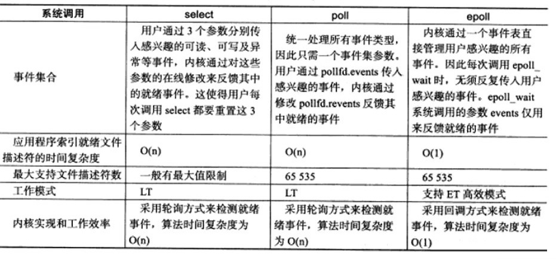

# epoll

## epoll本质

https://zhuanlan.zhihu.com/p/63179839

https://zhuanlan.zhihu.com/p/64138532

https://zhuanlan.zhihu.com/p/64746509

进程阻塞不占用cpu资源

epoll的要义是**高效**的监视多个socket

### select设计思想

假如能够预先传入一个socket列表，**如果列表中的socket都没有数据，挂起进程，直到有一个socket收到数据，唤醒进程**

select告诉你监听的socket有多少个有数据(n)，但是需要手动遍历fds来判断是哪些有数据（那需要n干什么，判断n>0或者直接有socket然后select结束阻塞不就行了？）

> 此处为socket的一种情形，当程序调用select时，内核会先遍历一遍socket，如果有一个以上的socket接收缓冲区有数据，那么select直接返回，不会阻塞。这也是为什么select的返回值有可能大于1的原因之一。如果没有socket有数据，进程才会阻塞。

也就是挂起进程，然后每一个接收到数据都能唤醒进程（也可以设置成别的回调）

### epoll的工作

#### 功能分离

select每次都要传递fds，然后阻塞

epoll先用epoll_ctl（修改监听fd队列，epfd）维护等待队列，再调用epoll_wait阻塞进程

#### 就绪列表

使用select程序不知道哪些socket有数据，需要遍历socket

epoll让内核维护一个就绪列表rdlist，保存所有有数据的socket的引用

### epoll的原理和流程

1. 创建epoll对象

   1. epoll_create，内核创建eventpoll对象，也就是epfd，也属于文件系统，也有等待队列，epfd应该是监听列表/监视列表
   2. 创建一个代表该epoll的eventpoll对象是必须的，因为内核要维护“就绪列表”等数据，“就绪列表”可以作为eventpoll的成员。（没看懂这句话，）

2. 维护监视列表

   1. epoll_ctl添加socket
   2. socket受到数据后，中断程序会操作eventpoll对象，而不是直接操作进程

3. 接收数据

   1. eventpoll对象相当于是socket和进程之间的中介，socket的数据接收并不直接影响进程，而是通过改变eventpoll的就绪列表来改变进程状态。
   2. 当程序执行到epoll_wait时，如果rdlist已经引用了socket，那么epoll_wait直接返回，如果rdlist为空，阻塞进程。

4. 阻塞和唤醒进程

   ​	这个可以看原文的图，把进程放入epoll对象的等待队列

### epoll的实现细节

这一点下面的源码解析讲得很好

epoll结构中的rdlist是双向链表，rbr（监视列表）是红黑树

rdlist需要快速插入就绪socket的引用

监视列表需要快速地添加移除节点，还要便于搜索避免重复添加，所以采用红黑树

### 结论

epoll在select和poll（poll和select基本一样，有少量改进）的基础引入了eventpoll作为中间层，使用了先进的数据结构，是一种高效的多路复用技术（我怎么记得是io复用？）。

## epoll源码解析

https://my.oschina.net/alchemystar/blog/3008840

## 这次答应我，一举拿下 I/O 多路复用

https://mp.weixin.qq.com/s/Qpa0qXxuIM8jrBqDaXmVNA

## epoll使用

- EPOLLIN ： 表示对应的文件描述符可以读（包括对端SOCKET正常关闭）；
- EPOLLOUT： 表示对应的文件描述符可以写；
- EPOLLPRI： 表示对应的文件描述符有紧急的数据可读（这里应该表示有带外数据到来）；
- EPOLLERR： 表示对应的文件描述符发生错误；
- EPOLLHUP： 表示对应的文件描述符被挂断；
- EPOLLET： 将 EPOLL设为边缘触发(Edge Triggered)模式（默认为水平触发），这是相对于水平触发(Level Triggered)来说的。
- EPOLLONESHOT： 只监听一次事件，当监听完这次事件之后，如果还需要继续监听这个socket的话，需要再次把这个socket加入到EPOLL队列里