## 常用标准库算法：

```cpp
find(beg, end, val); 
根据equal操作符，循序查找[first, last)内所有的元素，找出第一个匹配“等同条件者”。如果找到，就返回一个指向匹配元素的迭代器，否者返回迭代器end（）。

equal(beg1, end1, beg2); 
确定两个序列是否相等。如果输入范围中的每个元素都与从beg2开始的序列中的对应元素相等，就返回true；

min(val1, val2); 返回两个数中的大数
max(val1, val2); 返回两个数中的小数
min_element(beg, end); 返回最小元素的迭代器
max_element(beg, end); 返回最大元素的迭代器

//内置数组
fill(beg, end, val);    将值val赋给[beg,end)范围内的所有元素  
fill_n(beg, cnt, val);  将值val赋给[beg,beg+cnt)范围内的所有元素
copy(beg, end, tar);
copy_n(beg, cnt, tar);

accumululate(beg, end ,val);  对[beg,end)内元素之和,加到初始值val上。

//去重
unqiue(beg, end); 
去除相邻的重复元素(只保留一个),所以使用前需要对数组进行排序。这两个参数表示对容器中[it_1，it_2)范围的元素进行去重(注：区间是前闭后开，即不包含it_2所指的元素)
返回值是一个迭代器，它指向的是去重后容器中不重复序列的最后一个元素的下一个元素。

//反转
reverse(beg, end); 将区间[beg,end)内的元素全部逆序；

//统计
count(begin,end,val);  统计等于val的元素个数
count_if(beg，end，func); 函数count的_if版本
                       
//遍历
for(char c:s)   遍历字符串
vector<int>& vec；   遍历数组向量
for (int num : vec)
for(auto [k,v] : map)
    cout<< k << v <<endl;
for(auto [k,_]:map)                       
```

## 类型转换

```cpp
int i = std::stoi(str);
stol(long)/stoll(long long)/u(unsigned)
stof(float)/stod(double)/ld(long double)
    
string s = to_string(num);
```

## 内置数组函数

```cpp
//填充
fill(arr,arr+size,val);
```


## 常用头文件

### \<climits\> 

| name       | expresses                                                    | possible value*                              |
| ---------- | ------------------------------------------------------------ | -------------------------------------------- |
| CHAR_BIT   | Number of bits in a `char` object (byte)                     | `8` or greater*                              |
| SCHAR_MIN  | Minimum value for an object of type `signed char`            | `-127` (`-27+1`) or less*                    |
| SCHAR_MAX  | Maximum value for an object of type `signed char`            | `127` (`27-1`) or greater*                   |
| UCHAR_MAX  | Maximum value for an object of type `unsigned char`          | `255` (`28-1`) or greater*                   |
| CHAR_MIN   | Minimum value for an object of type `char`                   | either SCHAR_MIN or `0`                      |
| CHAR_MAX   | Maximum value for an object of type `char`                   | either SCHAR_MAX or UCHAR_MAX                |
| MB_LEN_MAX | Maximum number of bytes in a multibyte character, for any locale | `1` or greater*                              |
| SHRT_MIN   | Minimum value for an object of type `short int`              | `-32767` (`-215+1`) or less*                 |
| SHRT_MAX   | Maximum value for an object of type `short int`              | `32767` (`215-1`) or greater*                |
| USHRT_MAX  | Maximum value for an object of type `unsigned short int`     | `65535` (`216-1`) or greater*                |
| INT_MIN    | Minimum value for an object of type `int`                    | `-32767` (`-215+1`) or less*                 |
| INT_MAX    | Maximum value for an object of type `int`                    | `32767` (`215-1`) or greater*                |
| UINT_MAX   | Maximum value for an object of type `unsigned int`           | `65535` (`216-1`) or greater*                |
| LONG_MIN   | Minimum value for an object of type `long int`               | `-2147483647` (`-231+1`) or less*            |
| LONG_MAX   | Maximum value for an object of type `long int`               | `2147483647` (`231-1`) or greater*           |
| ULONG_MAX  | Maximum value for an object of type `unsigned long int`      | `4294967295` (`232-1`) or greater*           |
| LLONG_MIN  | Minimum value for an object of type `long long int`          | `-9223372036854775807` (`-263+1`) or less*   |
| LLONG_MAX  | Maximum value for an object of type `long long int`          | `9223372036854775807` (`263-1`) or greater*  |
| ULLONG_MAX | Maximum value for an object of type `unsigned long long int` | `18446744073709551615` (`264-1`) or greater* |

int如果是四字节，那么INT_MAX就是2^31-1

具体要看题目要求，如果输入值最大是2^31，就不能用INT_MAX

```cpp
# include  <unordered_map>
size_type count ( const key_type& key ) const
count函数用以统计key值在unordered_map中出现的次数。实际上，c++ unordered_map不允许有重复的key。因此，如果key存在，则count返回1，如果不存在，则count返回0.

iterator find ( const key_type& key );
如果key存在，则find返回key对应的迭代器，如果key不存在，则find返回unordered_map::end。因此可以通过

map.find(key) == map.end()
```

### 包含所有c++头文件的头文件

```cpp
#include<bits/stdc++.h>
```

优点：

- 节约时间与工作量

缺点

- 不属于GNU C++库的标准头文件，在部分情况下可能会失败
- 包含了一些不必要的头文件 ，编译时间增加
- 不是C++标准的一部分，不可移植，因为可能有一些编译器不支持

## Vector转Set与Set转Vector

```cpp
set<int> st(vec.begin(), vec.end());
vec.assign(st.begin(), st.end());
```

## 二维数组创建

```cpp
vector<vector<int> > vec(m,vector<int>(n));

int** a2 = new int*[rows];
for(int i=0;i<rows;i++)
    a2[i] = new int[columns];

for(int i=0;i<rows;i++)
    delete []a2[i];
delete []a2;
```

## 检测元素是否存在

```cpp
vector<int>::iterator it = find(track.begin(), track.end(), value);
if (it != track.end())
   cout<<*it<<endl;
else
   cout<<"can not find"<<endl;

//某容器a
if(a.find(tar) != a.end()) 找到了

if(a.count(tar) != 0) 找到了
```


## 容器操作

楼主从cpp reference抄过来的

1、vector

vector 容器结构示意图：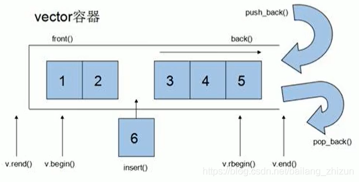

 vector：顺序存储容器，和数组非常相似，也被称为单端数组。只能从尾部增加删除元素。

vector 常见操作：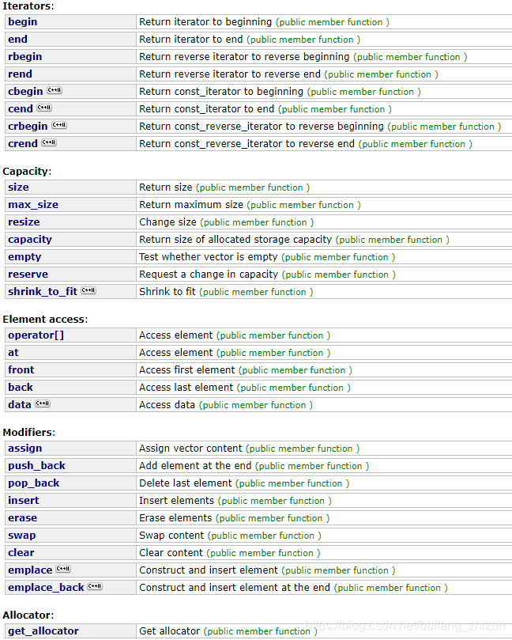

2、deque

deque 容器结构示意图：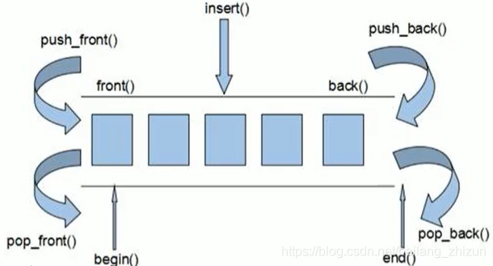

deque：顺序存储容器，两端都可插入与删除，也被称为双端数组。虽然都是顺序存储容器，但是vector访问元素的速度要比deque快。

deque内部工作原理：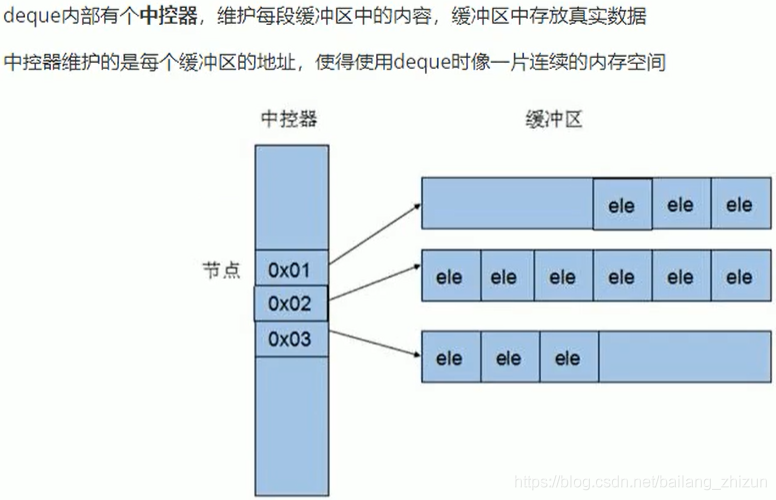

 deque常见操作：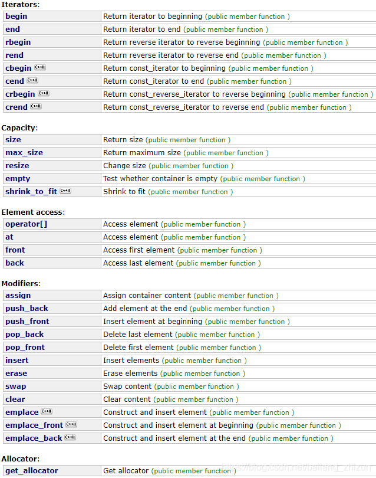

3、queue

queue 容器结构示意图：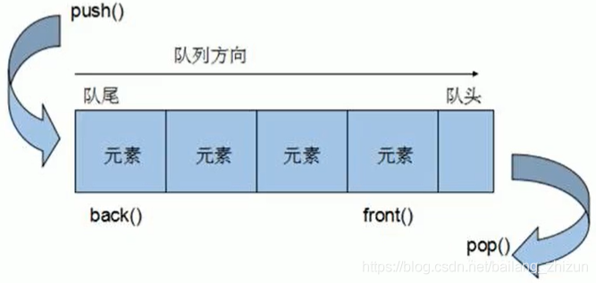

queue：先进先出（First In First Out, FIFO）的存储容器（两端），只能从尾部插入、头部删除。

queue常见操作：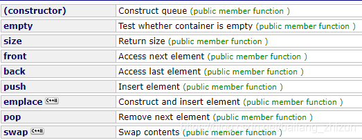

4、list

list 容器结构示意图：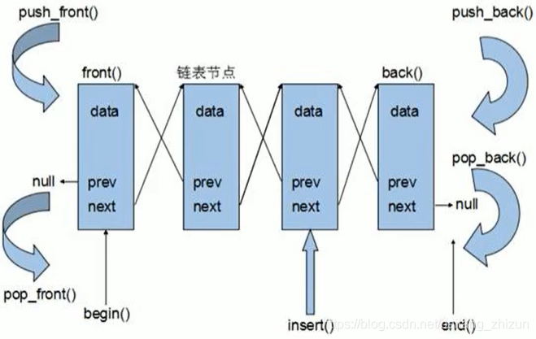

 list: 非连续的存储空间，是一个双向循环链表，动态存储分配。

list 常见操作：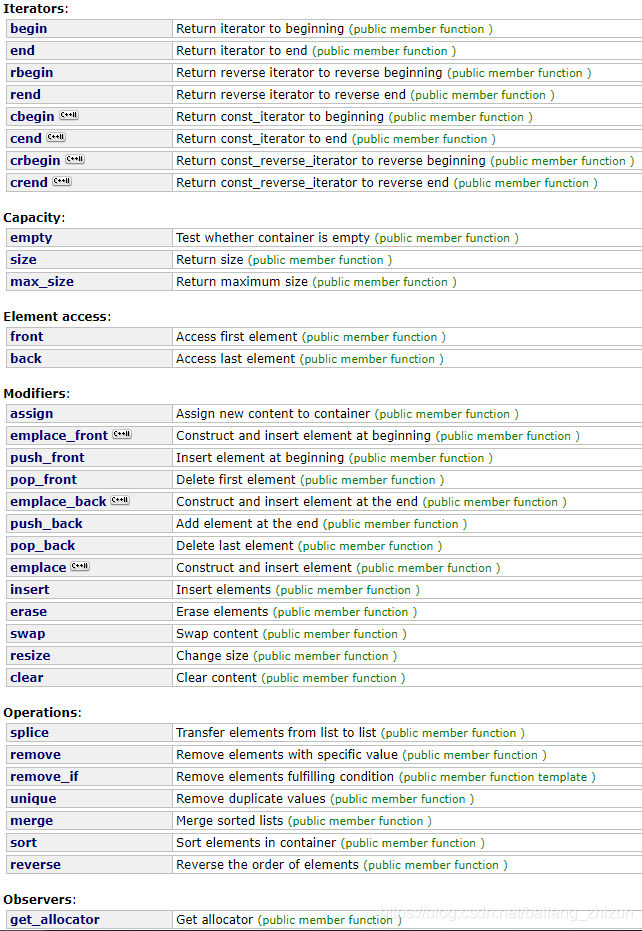

5、stack

stack 容器结构示意图：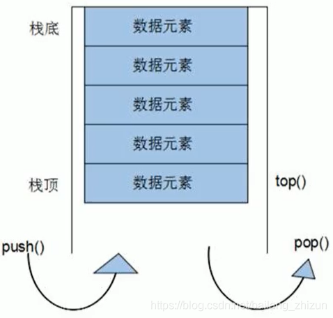

stack: 一种先进后出(First In Last Out, FILO)的数据结构，只有一个出口，只能在栈顶插入与删除。

stack 常见操作：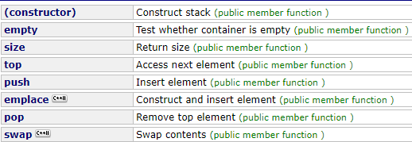

6、set/multiset

set: 集合，一种关联性容器。底层是红黑树实现的。

特点：

1）、所有元素在插入时自动被排序；

2）、set不允许容器中有重复的值，multiset允许容器中有重复的元素；

set常见操作：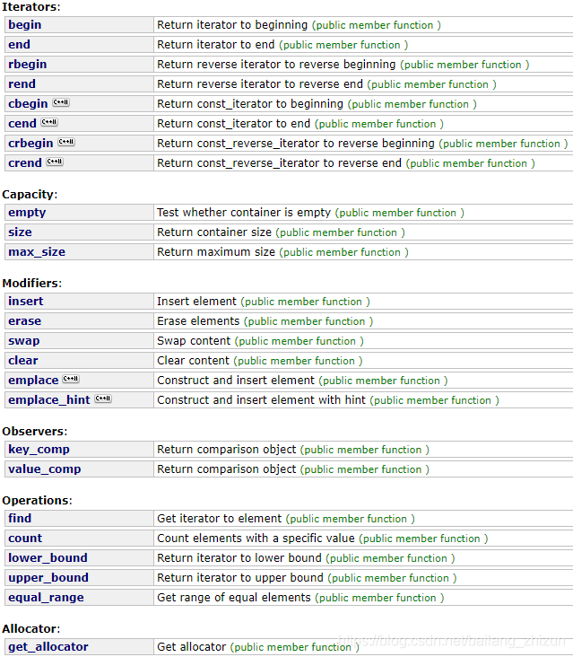

7、map/multimap

map: 一种关联性容器。底层是红黑树实现的。

特点：

1）、map中所有的元素都是pair，其中pair第一个元素为key(键值)，第二个元素为value(实值)；

2）、所有元素都会根据元素的key(键值)自动排序；

3）、map中不允许有重复的key值元素，multimap中允许有重复的key值元素；

map 常见操作：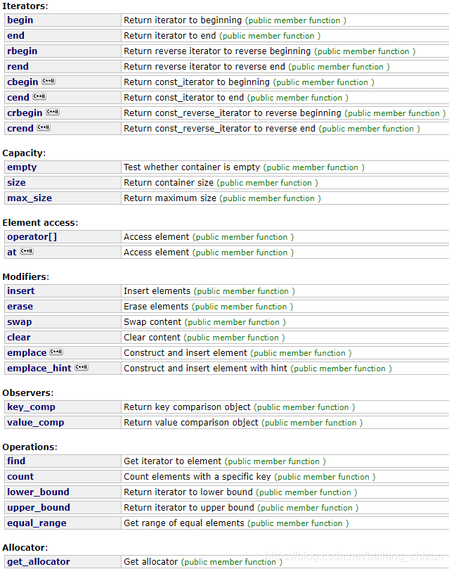

 8、几种容器的对比

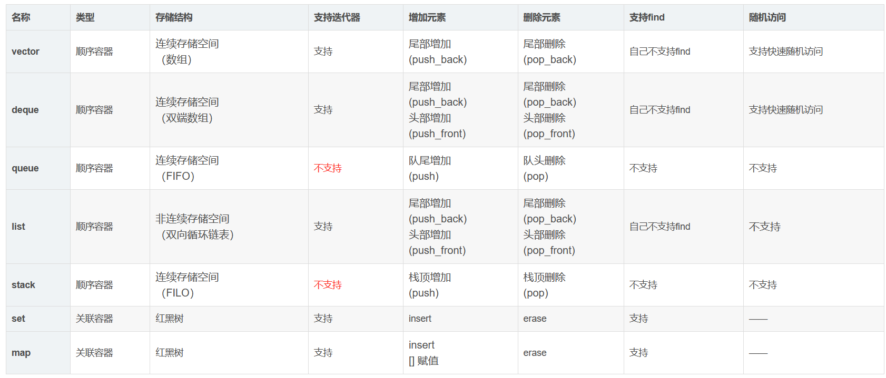


> 1. 对于自己不支持find（即，成员函数没有find）的，可以使用泛型算法进行find；
>
> 2. 只有list自己含有sort成员函数，其它能排序（vector、deque）的容器只能调用泛型算法；
>
> 3. 对于  erase 操作
>
>    对于序列容器vector,deque来说，使用erase(itertor)后，后边的每个元素的迭代器都会失效，但是后边每个元素都会往前移动一个位置，但是erase会返回下一个有效的迭代器；     
>
>    对于关联容器map set来说，使用了erase(iterator)后，当前元素的迭代器失效，但是其结构是红黑树，删除当前元素的，不会影响到下一个元素的迭代器，所以在调用erase之前，记录下一个元素的迭代器即可。     
>
>    对于list来说，它使用了不连续分配的内存，并且它的erase方法也会返回下一个有效的iterator。