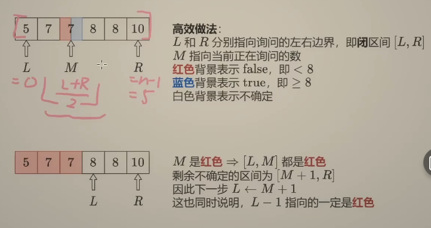
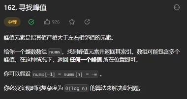
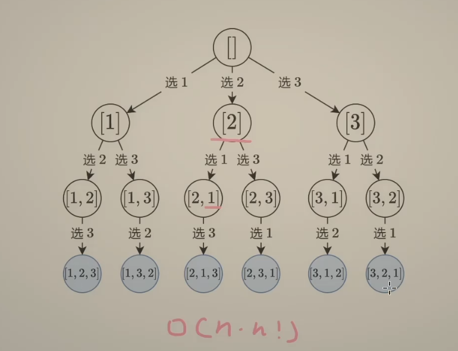
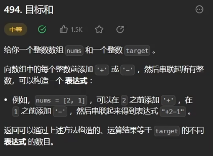

## 小技巧

1. left - right +1，是否要加1，可以考虑left=right的情况
2. 开始的时候先特判，把没有结果的简单情况先return
3. python遍历三个序列 for i,j,k in **zip**(arr1,arr2,arr3)
4. cpp取平均防溢出，(a-b)/2+b


## 1 同向双指针 滑动窗口


暴力：确定左端点向右（或者相反）扩展 

O(n^2)

双指针：但是数组都是正数，所以确定了最左的和为tar的左端点和右端点，只需要把右端点向右移动一位，再删除左边的点直到小于tar（左移左端点），然后就得到了下一个子数组。

复杂度

由于left和right都是扫一遍数组，无非是先动和后动，所以是O（n）

适用于：往一个方向移动具有单调性，[移动，然后使用while直到满足（不满足）要求，再调整]*n

思路：基于上一个数组，滑动后调整得到下一个数组


返回的是数组个数

假设左端点l，右端点r，个数就是l-r+1

## 2 相向双指针 三数和

### 两数和


暴力：对于每个数，遍历所有后面的数 O(n^2)

暴力没有用到已经排序这个性质

所以如果两个数加起来大于tar，那么大端点要变小，小于tar，小端点要变大。

每次和tar比较大小O(1)，然后去掉一个数，所以是O(n)

衡量算法效率：获取信息量

每次比较获取了关于中间所有数的大小关系，O(1)时间获取O(n)信息

### 三数之和


先排序，一般得到一个从-n1\~n2的数字序列

i: 0\~n-3	j: i+1\~n-2	k: n-1

先确定了i，再让jk往中间靠拢。由于是负数和正数向0的靠拢，所以有很多jk对，当s=0的时候，确定了一个对，此时需要跳过重复的数字，保持j<k，对于j，和上次相同就+1，对于k，-1。然后这样对于每个不同的i，得到的jk处数字都是不同的。

每次 i 都需要跳过相同的数字，所以每次判断这次的数字和i-1的数字是否相同

特殊情况：最小三个数加起来大于0，最大三个数之和小于0

## 3 双向双指针 接雨水 前后缀分解

### 盛最多水的容器


双向往中间靠拢，让短的边先动，如果选择的边和原先另外长的那个边组成的面积更大，就选择这条边（原理是这样）

实际只需要每次计算面积后让短边往中间移动就行了

实际复杂度就是移动指针O(n)

### 接雨水


对于其中某一列，只用把他看成两个板盛水


1. 使用两个数组分别存储前缀和后缀最大值，

   前缀最大值i表示i之前的最大值和i处取max，也就是i处的左板子高度，后缀同理，于是对于i处的雨水，

   h = min(i前缀最大值，i后缀最大值) - i处高度

   （i处前缀最大值就取决于i处高度，应该看成到了i，左侧就出现了等于高度的墙壁，只不过被填满了放不进雨水）

   s = h*1

   前后缀最大值用，遍历算s用了都是O(n)

   空间也是O(n)

2. 前缀和后缀最大值不需要算完，假设前缀最大值算到i，后缀算到j，那么对于i的面积，如果当前的前缀最大值已经小于等于后缀最大值，由于后缀最大值推到i是递增的，所以未来，h也一定取决于i处前缀最大值，这时候面积已经确定了。j处面积同理。所以每次只需要推进较小那一侧就行了，而且只需要用数字表示，不需要用数组存储

   时间只遍历一次，O(n)

   空间O(1)

### 4 二分查找 循环不变量


**红蓝染色法**	红色不包含tar，蓝色包含tar




```cpp
// 这里使用开区间更容易理解，不断染色，也就是不断向内推进区间，最终所有元素都被染了色
// 关键是判断mid是不是蓝色，最终蓝色正好包裹到答案，所以mid是蓝色 = mid或者mid左侧是答案
// l r都是开区间，不包含当前值
// 红色)___未染色__(蓝色
//    l)__________(r
// 初始化很重要，红色区域一定没有答案，所以是-1，数组最左端的值可能是答案，所以已经是蓝色了，r初始化成最左端元素
// 因为n.size() >= 1，即使所有元素都是蓝色，mid也始终>=0，最后答案也是返回r，所以不会有越界。
int l=-1;r=n.size()-1;
//染色未完成
while(l+1<r){
    if(mid_is_blue)
        r = mid;
    else
        l = mid;
}
return r;
// 最终答案就是第一个蓝色值
//    _)(blue
//	  l  r
```


2. 寻找目标

   找>x左侧，相当于>=x+1，于是lower_bound(x+1)

   找<=x右侧，相当于>=x+1的左侧-1，于是lower_bound(x+1)-1

   找<x同理

   于是一个函数就能确定一个数字区间

## 5 二分查找，搜索旋转排序数组




假设已经确定了一个峰顶，每次判断M和M+1的大小，如果M大，那么就要从M开始向左侧爬坡，反之就是右侧。

由于-1和n为负无穷，所以就算最后找到边界也一定是峰顶。

可能找不到吗，万一mid右侧单调增加，左侧那半边有个峰顶怎么办？不可能，这样边界一定是峰顶。

while条件为区间不为空，所以最后L就是指向峰顶


也就是一个两段的递增数组，mid和右侧比较就行。


主要是判断mid和tar是不是在同一段上，它们分别和r比较

## 6 反转链表


对于反转中间一段，比如1,2,3节点，那么最后应该得到0-3-2-1-4这样的链表


为了保持一般性，可以反转包括头结点的一段，需要加一个哨兵节点dummyNode，它的next为head

dummy是不能动的，让p0指向反转前的那个节点

需要三个指针，pre，cur，nxt

pre，cur用于反转cur节点的指向，nxt负责保存状态进行下一次迭代。

初始化：pre = null，cur=第一个修改点

迭代次数：进入就修改cur的指针，n = right - left +1，总共修改n次

结束(最后一次反转之后再迭代一下)：pre = 最后一个修改点, cur = 最后一个修改点右侧

设为p0指向第一个修改点的节点，让p0->next->next = cur，p0->next = pre

最后一次迭代，如果最后一个节点没有后继了，那么nxt当前已经是null，所以无法nxt = nxt->next，需要先判断nxt！=nullptr

return dummy->next


也就是必须要用dummy，并且每次翻转k个之后更新p0就行

## 7 快慢指针 环形链表 重排链表


快慢指针，慢支针走一步，快指针走两步就行


如果遇到环，快慢指针一定会相遇（追击是一定会遇上的，不会跨过，因为每次二者之间距离-1）


当快慢指针相遇，慢支针还没有走完一整圈，最坏情况是慢支针在入口，快指针在入口后面的一个节点，那么快指针追上慢支针只需要n-1步（相对距离）


所以相遇之后，让head和slow一直走，最后会在入口相遇，就得到了入口节点

## 8 前后指针 删除 去重


删除节点如果不知道父节点，那么直接拷贝子节点的值然后删除子节点


处理头结点需要创建dummynode

这道题可能会删除头结点，所以需要dummynode

先让右指针走n步，再让左指针开始走，直到右指针到了末尾，此时删除左指针的节点（或者左指针后面，画个图看看）


左指针保持不动，右指针找相同的值，找到就删除，否则后移


可能会删除头结点，所以需要dummynode


判断cur+1和cur+2，相同就删除cur+1 

## 9 递归 二叉树的最大深度

思路1：让子树返回它的深度

思路2：把自己到root的深度交给子树，递归到叶子的时候更新全局变量

## 10 二叉树 相同 平衡 对称 右视图


转化为子树是否相同


比较左右子树就行了


递归得到子树高度，算一下绝对值。

如果不平衡，直接返回-1


传递一个深度，维护一个全局变量深度就行了（面试fabrie原题）

## 11 二叉搜索树 前序 中序 后序

节点在遍历中的位置

前序：先访问节点值，再递归子树

中序：左子树，节点，右子树

后序：左右子树，节点


### 前序：


对于一个节点，先判断它的节点在不在范围内，再验证子树在不在范围内，设自己的值为t，范围要求为(a,b)，对于左子树，范围为（a,t），右子树范围为(t,b)

INT_MAX　　　　　　 int 最大值
INT_MIN 　　　　　　int 最小值

### 中序

一直递归左子树，再递归右子树，会得到递增序列，所以维护一个全局变量，初始为-inf，先递归左子树，再让自己和变量比较，再递归右子树，就行了。

### 后序

左右子树把自己的范围往上传递，根节点为a，范围就是[a,a]，空节点返回（+inf，-inf），当前节点的值一定大于左子树的最大值，小于右子树的最小值，这样空节点一定是判断正确的，然后把左右子树范围拼起来传上去。当判断失败，返回(-inf,+inf)，这样对于上面节点一定会判断失败的。
## 12 二叉树最近公共组先


没啥，判断节点在哪然后返回就行

## 13 二叉树 层序遍历

BFS


使用两个数组

也可以用一个队列，记录每层的长度

while(队列不为空){

​	pop出一个节点a

​	把a的左右节点加入队列

}

###　返回最后一层最左侧的节点

可以使用层序遍历输出最左侧，或者直接按从右到左的顺序加入队列，这样最左侧的最后入队也会最后出去。

## 14 回溯


这里的path就相当于一个string，只不过string通过push_back()填充，path直接赋值填充（string需要pop_back()更换路径，path直接赋值就能覆盖原来的路径了）然后path初始化为最大深度，最后加入ans时，如果ans每个单元就是list就直接添加path的复制，如果ans单元是list就把path拼起来，所以才需要''.join()


回溯：增量构造答案，使用递归实现


叫做dfs是因为这就是一个深搜，dfs(i)表示的是构造i以及i以后的过程，像一个树一样包含后面的所有调用


```cpp
//回溯的代码都需要两个数据结构，一个ans容器，存储每种路径的结果，另一个path，也就是当前的路径，这个path是共享的
vector<string> ans;
string path;
//模板1 每次选或者不选一个数
int A(int i){
    if(i == n)
        ans.push_back(path); //到达终点
    
    dfs(i+1);
    
    path += s[i];
    dfs(i+1);	
    path.pop(); //临时使用了path，恢复现场
}
//模板2 由于数字不能重复，所以i可以加上[i+1,n-1]的任意几个数
int A(int i){
    ans.push_back(path);//什么都不加,也是结果
    for(int j=i+1;j<n;++j){
        path += s[j];
        dfs(j+1);
        path.pop();
    }
}
```


字符的分割可以看成字符之间选不选择分割，枚举逗号

然后相向双指针判断回文子串

因为这里必须要分割完，所以要i==n才能加入结果（就算逗号不选也要遍历到最后）

时间复杂度没听懂，todo

## 15 回溯 组合型 剪枝


剪枝技巧：组合问题可以提前结束，比如已经选到了指定数目，或者剩余数目不够选


逆序遍历可以让剪枝部分判断剩余可选的数字的逻辑变得简单

可以进入dfs判断，也可以缩短j的遍历窗口


## 16 回溯 排列型 N皇后




时间复杂度计算：

1. 直接路径个数\*深度O(n\*n!)
2. 精确计算节点个数O(e*n!)
3. 思路如下图，O(k*n!) = O(n!)


用bool数组记录也需要恢复现场，因为这个数组是通用的，需要和临时变量path保持一致


每行每列有且只有一个皇后，所以可以用一个数组col，col[i]表示第i行皇后位置


用个函数来检测


时间复杂度等于枚举全排列加一个检测


r+c,r-c用哈希表记录，index = r+c/r-c+n-1(防止为负数)

## 17 从记忆化搜索到递推 打家劫舍

**记忆化搜索都可以转换成递推**


dfs(i)表示从>=i的元素得到的结果

由于在这种情况下，在不同时间计算的dfs(i)的结果是完全一致的，所以可以记忆化（前面的回溯应该不行，因为前面的回溯的结果虽然一样但是是一个复杂的数）

时间复杂度：单个状态计算时间\*状态个数 = O(1)*n

空间复杂度：O(1)


手动初始化0,1这样的初始值，然后直接for循环递推算后面的值

避免出现负数，可以把i设置为从2开始

时间O(n)空间O(n)


更可以只存2个值，滚动数组

空间优化到O(1)

## 18 01背包 完全背包 目标和 零钱兑换

先考虑回溯


如何存储记忆化搜索的结果？参考python @cache装饰器的做法，直接存储参数和返回值，也就是参数有几个，用于保存结果的数组就有几个维度，这样一想那么01背包只需要记录i和c的结果就行，二维数组

上图的思路dfs计算的是<=i的结果，也就是逆序遍历，如果顺序遍历那么应该记忆>=i的结果，（先遍历到的节点使用后面节点的结果，所以记录中的都是当前节点后面的结果）




三种递推运算

1. 求方案数：dfs() = dfs() + dfs()

   满足1，不满足0

2. 求最大：dfs() = max(dfs(), dfs()+a)

   满足正常返回，不满足INT_MIN

3. 求最小：dfs() = min(dfs(),dfs()+a)

   满足正常返回，不满足INT_MAX

```cpp
//以01背包为例
//恰好装
if(i<0){
   if(c==0) return 1;//满足
   else return 0;//不满足
}
//至多装
if(i<0){
    if(c>=0) return 1;
    else return 0;
}
//至少装,假设t = 总容量 - 至少装的量
if(i<0){
    if(c<=t) return 1;
    else return 0;
}
```

这道题(目标和)可以转换成“恰好”这种变形

疑问：因为输入数组随便加负号，所以可以看成每一项非负?不用这么麻烦，都一样计算的

假设加了正号的数的和为p，所有元素的和s，添加负数的和就是s-p

p-(s-p) = t

p = (s+t) / 2

然后就变成了挑选一些数，使得他们的和恰好等于p

由于p是非负整数，所以s+t>=0,且一定要是偶数，这一点可以在最开始就判断

### 记忆化搜索转换成递推具体方法

1. 递归改循环，逆序的记忆化搜索->由简单到复杂的循环

2. 记忆化搜索：从复杂到简单     ->      递推：从简单到复杂

3. 递推空间复杂度优化1:

   记忆化搜索：k维记录数组     ->      递推：（k-1）*（d+1）  循环数组

   d表示递推深度：dfs(i) = dfs(i-1) ... dfs(i-d)	d = 1就是i-1直接能推出i

   **避免负数下标** dfs(i+d) = dfs(i+d-1) ... dfs(i)

   k维少了的那个维度就是记录i的维度

   此时前面根据d层，推出下一层，就可以删除第一层

   **具体实现方法**：一共用到了d+1维，取余

   ```cpp
   f[i+d][?] = f[i+d-1][?] + ... + f[i][?]
       改成
   f[(i+d)%(d+1)][?] = f[(i+d-1)%(d+1)][?] + ... + f[i%(d+1)][?]
   ```

4. 递推空间复杂度优化2：

   如果答案是单向递推出来的，比如递推	i+d行、c列	只有	i行小于等于c的列	推出，那么就可以逆序地覆盖第i行

   此时只需要(k-1) * d循环数组，i那一层可以直接被i覆盖，不需要另外开一层记录i

   所以可以mod d运算


与01背包唯一区别：

选了一个物品之后，可以继续选

```cpp
dfs(i,c) = max(dfs(i-1,c),dfs(i,c-w[i]) + v[i])
```


```cpp
//求最小个数
dfs(i,c) = min(dfs(i-1,c),dfs(i,c-w[i]) + 1)
```

## 19 最长公共子序列 编辑距离


 
